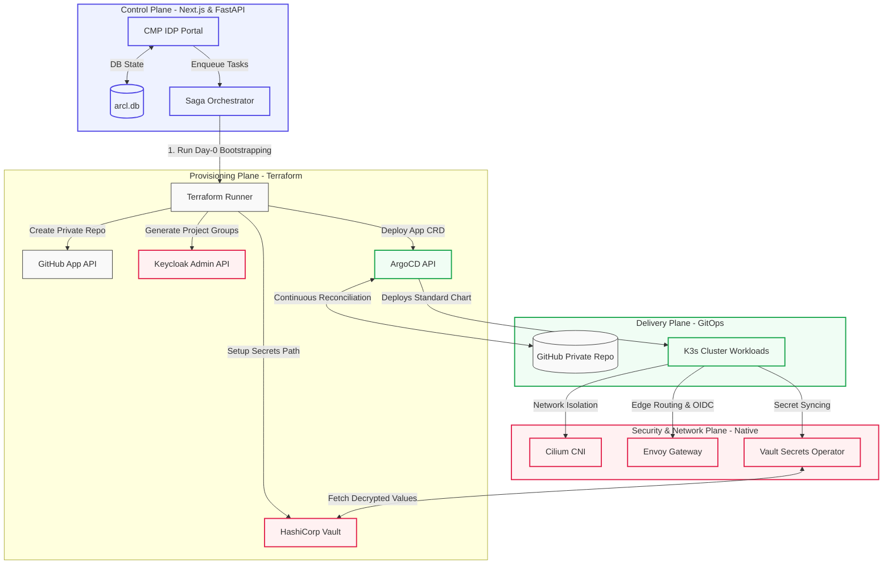

# System Overview: Cloud Native Platform (CNP)

## 1. Architectural Paradigm
The CNP relies on a decoupled, asynchronous, and GitOps-driven architecture. Instead of the Cloud Management Platform (CMP) directly interfacing with Kubernetes API servers to deploy pods, it acts as an **Orchestrator of Orchestrators**. 

The Single Source of Truth (SSOT) is always Git.

---

## 2. Global Component Interaction

The platform is structured into four functional planes, ensuring clear segregation of duties:

---

### A. The Control Plane (CMP Backend & Frontend)
* **Role**: The user-facing portal (IDP).
* **Stack**: Next.js (Frontend), FastAPI (Backend), SQLite/PostgreSQL, Boto3/OpenStackSDK.
* **Responsibility**: Captures user intent (e.g., "Deploy application X into Project Y"). It manages local metadata, coordinates async background tasks using a strict Saga pattern, and hosts the real-time health-polling dashboard.

### B. The Provisioning Plane (Terraform)
* **Role**: Infrastructure and Bootstrapping (Day-0).
* **Responsibility**: 
  1. Clones the requested Git App Template into a newly generated private GitHub repository.
  2. Creates Vault KV paths (`kvv2/projects/<project_name>/<app_name>`).
  3. Configures Keycloak (generates Tenant Realms, Client IDs, and group mappings).
  4. Configures Cloudflare DNS and dedicated application micro-tunnels.
  5. Deploys the ArgoCD `Application` Custom Resource (CR) and repository access secrets.

### C. The Delivery Plane (ArgoCD & Helm)
* **Role**: Continuous Deployment & Reconciliation (Day-1).
* **Responsibility**: ArgoCD monitors the application's private GitHub repository, reads the `deploy/values.yaml` file, and compiles it against the centralized generic Helm chart. Drift detection and automated syncs are handled natively.

### D. The Security & Network Plane (K8s Native)
* **Cilium CNI**: Enforces network policies (`CiliumClusterwideNetworkPolicy`) to isolate tenant namespaces.
* **Envoy Gateway**: Terminates incoming TLS, routes external traffic using standard Gateway API `HTTPRoute` resources, and enforces Keycloak OIDC at the edge via a `SecurityPolicy`.
* **Vault Secrets Operator (VSO)**: Automatically synchronizes Vault secrets into native K8s `Secret` objects using service account tokens.

---
**Next Step**: Continue to [Multi-Tenancy & Isolation Model](02-tenancy-and-isolation.md).
