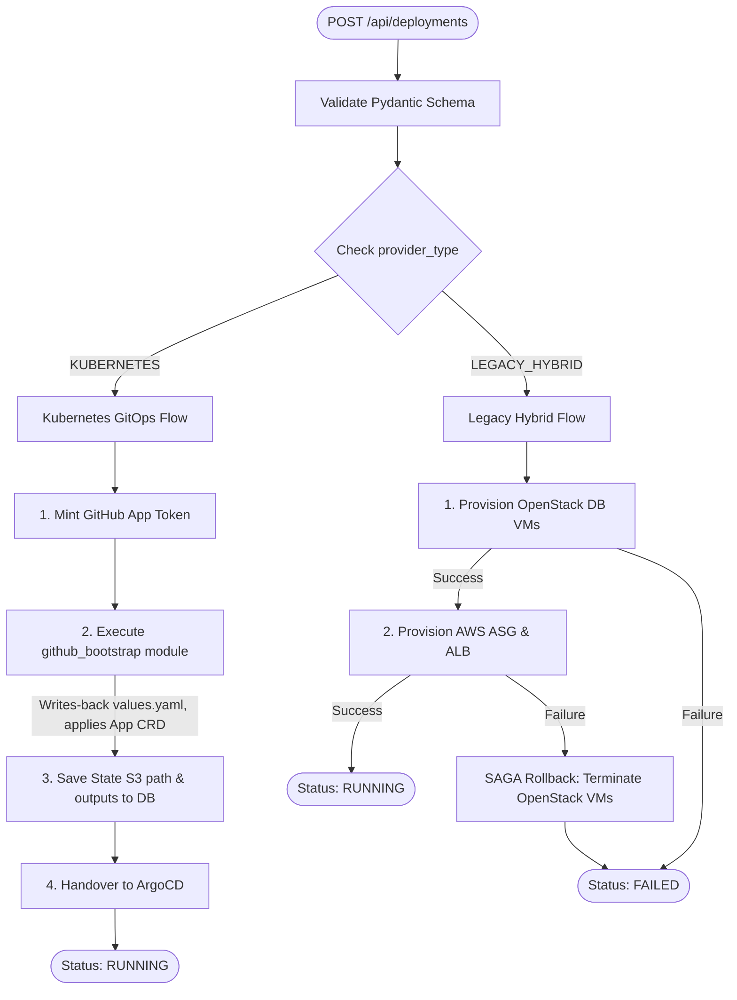
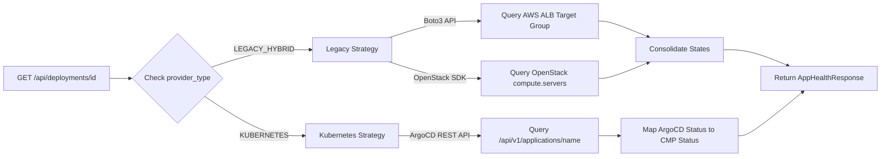

# CMP Portal Architecture & Dashboard

The Cloud Management Platform (CMP) is the developer-facing Internal Developer Portal (IDP). It is designed as a **Multi-Provider Hybrid Portal**, allowing developers to deploy and manage legacy IaaS stacks (AWS Auto Scaling Groups + OpenStack DB) alongside modern K3s GitOps workloads from a single interface.

---

## 1. Directory & Codebase Layout

The CMP codebase is structured as a monorepo to maintain strong contract alignments between the Next.js frontend schemas and the FastAPI routers.

```text
arcl-cmp/
├── backend/
│   ├── app/
│   │   ├── core/              # Config, DB connections, and WAL initialization
│   │   ├── models/            # SQLAlchemy database entities (Deployments, Project Owners)
│   │   ├── schemas/           # Pydantic payloads and validation models
│   │   ├── routers/           # FastAPI HTTP endpoints (deployments, projects, catalog, account)
│   │   ├── services/          # Pure domain logic (SAGA, Keycloak admin, GitHub App, Vault VSO)
│   │   └── terraform/         # Day-0 Bootstrapping local modules (github_bootstrap)
│   └── alembic/               # Database migrations
└── frontend/
    └── src/
        ├── app/               # Next.js App Router folders (account, projects, auth)
        ├── components/        
        │   ├── account/       # GitHubLinkButton (OAuth installation callback)
        │   ├── catalog/       # CatalogGrid, DeployModal
        │   ├── dashboard/     # Overall health summaries
        │   └── projects/      # AppCard, AppConfigPanel (GitOps), MembersPanel
        ├── lib/               # API clients, custom React hooks
        └── types/             # Shared TypeScript interface definitions
```

---

## 2. Backend Orchestration (The SAGA Strategy)

The `saga_orchestrator.py` service acts as the central workflow router. It executes different state-machine paths depending on the template's `provider_type`.

### A. The SAGA Execution Flow:



---

## 3. Multi-Provider Health Monitoring (Strategy Pattern)

The `monitoring_service.py` is implemented using a Strategy Pattern. When the frontend or the background poller queries the health status of a deployment, the service routes the request to the correct cloud provider SDK:



### ArgoCD to CMP Status Mapping:
When querying a Kubernetes-native GitOps deployment, the backend translates ArgoCD's statuses into standardized CMP states:
* ArgoCD `Healthy` & `Synced` ➔ CMP `healthy`
* ArgoCD `Progressing` ➔ CMP `deploying`
* ArgoCD `Degraded` or `OutOfSync` ➔ CMP `degraded`
* ArgoCD `Missing` or `Unknown` ➔ CMP `failed`

---

## 4. Frontend Dynamic Components

The Next.js frontend uses conditional rendering to adapt components to the underlying infrastructure type.

### A. The Dynamic `DeploymentCard.tsx`
* **For Legacy Deployments**: Displays the public AWS Application Load Balancer DNS endpoint and raw OpenStack VM IP addresses.
* **For Kubernetes Deployments**: Renders deep-link action buttons pointing directly to the Git repository, the matching ArgoCD Application dashboard, and the project's HashiCorp Vault namespace.

### B. The `AppConfigPanel.tsx` (Day-2 GitOps Editor)
When viewing a `kubernetes` deployment, the frontend renders a dedicated configuration editor. It fetches the live, commented `values.yaml` from GitHub, renders inputs (sliders for replicas, switches for SSO), and executes deep-merge PATCH commits on save, bypassing the Kubernetes API.

---
**Next Step**: Continue to [Keycloak Identity & Access Management](02-identity-keycloak.md).