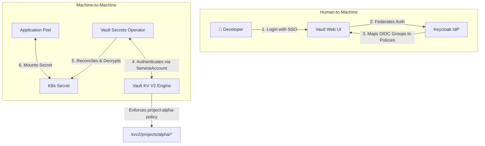

# Secrets Management: HashiCorp Vault

CNP utilizes HashiCorp Vault for centralized, secure, and dynamic secret injection. No secrets are ever stored in plain text in GitHub, ArgoCD, or the CMP database. 

---

## 1. Secrets Architecture Overview

The secrets pipeline is split into two access vectors: **Human-to-Machine (OIDC)** for developer administration, and **Machine-to-Machine (Kubernetes Auth)** for automated application syncing.



---

## 2. Developer Experience (Human OIDC Access)

Developers access the Vault UI using their unified Keycloak credentials. Vault delegates authentication to Keycloak via the `oidc` auth path.

### A. Keycloak OIDC Mapping
Vault is configured with an OIDC authentication backend. The Keycloak `groups` claim in the JWT is used to dynamically map the developer's project groups (`project-<name>-members` or `project-<name>-admins`) to specific Vault policies.

### B. Project Policy Template
During Day-0 project bootstrapping, Terraform writes a scoped policy restricting the developer's access to their project's path:

```hcl
# project-alpha-dev-policy
path "sys/mounts" {
  capabilities = ["read"]
}
path "sys/internal/ui/mounts/*" {
  capabilities = ["read"]
}

# Grants full CRUD capabilities inside the project sandbox
path "project-alpha/*" {
  capabilities = ["create", "read", "update", "delete", "list"]
}
```

---

## 3. Application Experience (Machine Access via VSO)

Pods retrieve secrets using the **Vault Secrets Operator (VSO)** (`ricoberger.de/v1alpha1`), ensuring that no raw Vault tokens are ever injected into application manifests.

### A. The Kubernetes Auth Flow
1. The application Pod starts in the `alpha-frontend` namespace.
2. The VSO (acting on behalf of the namespace) presents its local Kubernetes `ServiceAccount` JWT token to Vault's `/v1/auth/kubernetes/login` endpoint.
3. Vault validates the token against the K3s API server and checks that the ServiceAccount belongs to the allowed namespace (`alpha-frontend`).
4. Vault returns a short-lived token bound to the application's policy.
5. VSO decrypts the path, generates a native Kubernetes `Secret`, and mounts it to the Pod.

### B. Terraform Auth Role Provisioning
This secure handshake is made possible by the scoped Kubernetes auth role provisioned during Day-0:

```hcl
# Terraform-generated Vault Auth Role
resource "vault_kubernetes_auth_backend_role" "app_role" {
  backend                          = "kubernetes"
  role_name                        = "alpha-frontend-role"
  bound_service_account_names      = ["vault-secrets-operator"]
  bound_service_account_namespaces = ["alpha-frontend"] # Hard boundary
  token_ttl                        = 3600
  token_policies                   = ["project-alpha-policy"]
}
```

### C. The Application Manifest (`VaultSecret` CRD)
ArgoCD deploys the following resource alongside the application deployment to trigger the synchronization:

```yaml
apiVersion: ricoberger.de/v1alpha1
kind: VaultSecret
metadata:
  name: frontend-secrets
  namespace: alpha-frontend
  annotations:
    # Forces ArgoCD to sync the secret before creating deployment pods
    argocd.argoproj.io/sync-wave: "-1"
spec:
  # Path inside the isolated project KV engine
  path: kvv2/data/projects/alpha/frontend
  vaultRole: alpha-frontend-role
  type: Opaque
```

---
**Next Step**: Continue to [ArgoCD GitOps Delivery Specifications](04-gitops-argocd.md) (or return to the [Project Overview](../README.md)).