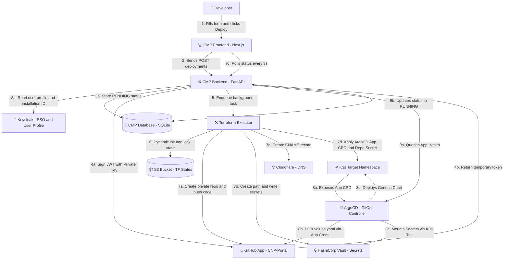

# Application Provisioning Workflow

This document details the exact sequence of events when a developer requests a new application via the CMP.

## The Trigger
The user selects a template (e.g., "FastAPI + React Stack") from the CMP Catalog, fills out the basic variables (App Name, Project Name, Replicas), and clicks **Deploy**.

## Phase 1: CMP & Terraform Bootstrapping
The CMP Backend enqueues an asynchronous background task to execute Terraform.

1. **Dynamic Token Retrieval:**
   - The CMP Backend fetches the Project's GitHub `installation_id` from the DB.
   - It requests a short-lived **Installation Access Token** from GitHub using the CNP App Private Key.
   - It injects this temporary token as a Terraform variable.

2. **GitHub Provisioning (Terraform):**
   - Terraform uses the temporary token to create a new Private GitHub repository inside the developer's chosen Organization or User account.
   - It pushes the initial "Git App Template" codebase (including the default `values.yaml` configurations) to the repository.
   - It sets up branch protection on the `main` branch.

3. **Kubernetes Namespace:** Terraform creates the K8s namespace `<project-name>-<app-name>`.

4. **Secret Generation:** Terraform generates initial random credentials (e.g., Database passwords) and stores them in Vault at `kvv2/projects/<project-name>/<app-name>`.

5. **ArgoCD Registration:**
   - Terraform configures ArgoCD to access the private repository. It creates a Kubernetes Secret in the `argocd` namespace containing the GitHub App credentials (App ID, Installation ID, and Private Key).
   - Terraform applies the ArgoCD `Application` Custom Resource (CR) pointing to the repository.

## Phase 2: GitOps Delivery (ArgoCD)
Once Terraform successfully completes Phase 1, the CMP marks the deployment state as `RUNNING` in its internal database. From this point forward, ArgoCD is fully responsible for the state of the cluster.

1. ArgoCD detects the new `Application` CR.
2. It uses the GitHub App credentials to dynamically authenticate with GitHub and pull the `values.yaml` from the private repository.
3. It fetches the "Generic Microservice Helm Chart" from the central Helm registry.
4. It merges the values and deploys the resulting manifests (Deployments, Services, Ingress, VaultSecret) into the application's namespace.

## Phase 3: Developer Day-2 Operations
- The developer clones their new private repository.
- To change infrastructure settings (e.g., scale from 2 to 5 replicas), the developer edits the `values.yaml` located in the `deploy/` folder of their repo.
- The developer commits and pushes the change to the `main` branch.
- ArgoCD automatically detects the drift, syncs the new replica count, and updates the cluster without any intervention from the CMP or Terraform.