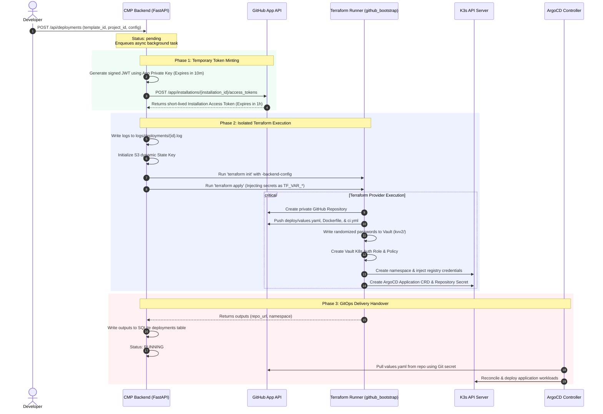

# Application Provisioning Pipeline (Day-0 Workflow)

## 1. Overview
The Day-0 Application Provisioning Pipeline is a fully automated, asynchronous workflow managed by the CMP backend. When a developer triggers a deployment, the system mints temporary tokens, initializes isolated Terraform state files, provisions multi-tenant cloud assets, and hands over control plane operations to ArgoCD.

---

## 2. End-to-End Orchestration Topology

The diagram below details the operational boundaries and sequence during the Day-0 provisioning cycle:



---

## 3. Deep-Dive Step Execution & Mechanics

### Step 1: Decentralized Token Exchange
To prevent security leaks, the CMP Backend never uses static personal access tokens (PATs). It mints an ephemeral token on-the-fly:

1. **JWT Generation**: The backend reads `GITHUB_APP_PRIVATE_KEY` and signs a JSON Web Token (JWT) with the RS256 algorithm:
   ```python
   payload = {
       "iat": int(now.timestamp()),
       "exp": int((now + timedelta(minutes=10)).timestamp()),
       "iss": "3836905" # CNP GitHub App ID
   }
   ```
2. **Access Token Request**: The JWT is exchanged for an installation access token:
   ```bash
   curl -X POST "https://api.github.com/app/installations/98765432/access_tokens" \
     -H "Authorization: Bearer <JWT>" \
     -H "Accept: application/vnd.github+json"
   ```
3. **Scoping**: The returned token (valid for 60 minutes) is injected into the Terraform environment as `TF_VAR_github_token`.

---

### Step 2: Isolated S3 State Configuration
To allow concurrent deployments without state-locking collisions, every deployment receives an isolated `.tfstate` key inside the S3 bucket:

```bash
# Executed programmatically by the Terraform Executor
terraform init \
  -backend-config="bucket=3-istor-tf-infra-aws" \
  -backend-config="key=cmp/projects/alpha/frontend.tfstate" \
  -backend-config="region=eu-west-3" \
  -backend-config="encrypt=true" \
  -backend-config="dynamodb_table=terraform-state-lock" \
  -reconfigure
```

---

### Step 3: Resource Provisioning (Terraform Apply)
During the `terraform apply` phase, the `github_bootstrap` module executes the following resources:
* **`github_repository.app`**: Provisions a private repository under the user's organization.
* **`github_repository_file.values_yaml`**: Generates and pushes the initial `deploy/values.yaml` containing the customized environment overrides.
* **`vault_generic_secret.app_secrets`**: Generates high-entropy passwords (32 characters) and stores them in Vault under `kvv2/data/projects/{project_name}/{app_name}`.
* **`vault_kubernetes_auth_backend_role.app`**: Binds the application service account in the new namespace to the Vault access policy.
* **`kubernetes_namespace.app`**: Provisions the isolated namespace with standard security labels (`pod-security.kubernetes.io/enforce: restricted`).
* **`kubernetes_manifest.argocd_app`**: Deploys the ArgoCD `Application` CRD.

---

### Step 4: GitOps Handover
Once Terraform outputs are captured and written to the CMP database, the deployment status transitions to `running`.
1. **Repository Authentication**: ArgoCD reads the custom K8s Secret `private-repo-creds` containing the GitHub App credentials.
2. **Reconciliation**: ArgoCD pulls the `deploy/values.yaml` from the newly created repository, renders the generic Helm chart, and deploys the workload.

---

## 4. Error Handling & SAGA Compensations

If any provisioning step fails (e.g., S3 backend timeout, GitHub API rate limits, or invalid cluster credentials), the platform executes a **compensating transaction** to prevent orphaned resources.

```
[ Step Failed ] ──► [ Trigger Compensation ] ──► [ run_deletion Task ]
                                                          │
                                                    (Rollback)
                                                          │
                                                          ▼
                                            [ Execute terraform destroy ]
                                                          │
                                                          ▼
                                            [ Mark DB status: FAILED ]
```

### Compensation Actions:
1. **State Recovery**: The background task catches the exception and immediately invokes the `run_deletion` task.
2. **Resource Destruction**: It re-initializes the Terraform executor using the identical S3 state key and executes `terraform destroy -auto-approve`.
3. **Database Update**: The deployment status is updated to `failed`, and the raw CLI error log is written to `step_message` so the developer can diagnose the failure from the dashboard.