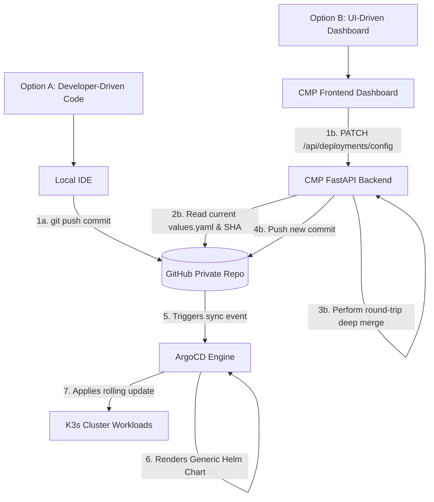

# Developer Configuration & GitOps Flow

To achieve true developer autonomy without exposing raw Kubernetes manifests, CNP implements a dual-pathway configuration model. The single interface between the developer and the infrastructure is the simplified `deploy/values.yaml` file located in the application's repository.

---

## 1. The Dual-Pathway Mutation Model

All changes must pass through Git before reaching the cluster. This model supports two concurrent workflows: **Developer-Driven (Code)** and **UI-Driven (CMP Dashboard)**. Both pathways converge at the Git repository, guaranteeing zero configuration drift.



---

## 2. The Configuration Interface (`deploy/values.yaml`)

This curated configuration interface abstracts complex resources (such as `HTTPRoute`, `SecurityPolicy`, `VaultSecret`, `Cluster`, and `OffhoursSchedule`) into a highly readable, developer-friendly YAML schema.

```yaml
# deploy/values.yaml
# ==============================================================================
# 🚀 CNP Application Configuration
# ==============================================================================
# This file is the single source of truth for your application's infrastructure.
# You can edit these values manually via your IDE or through the CMP Dashboard.

# -- Number of application pods running simultaneously
replicaCount: 2

# -- Container Image (Tag managed automatically by GHA & Image Updater)
image:
  repository: ghcr.io/3-istor/t1
  tag: "latest"
imagePullSecrets:
  - name: app-registry

# -- Compute Resources (Enforced by Kyverno limits/requests policy)
resources:
  requests:
    cpu: "50m"
    memory: "128Mi"
  limits:
    cpu: "100m"
    memory: "128Mi"

# -- Networking & Edge Security
ingress:
  enabled: true
  hostname: "t1-test.3istor.com"
  sso_protected: true # Toggles OIDC SSO at the cluster edge

# -- Vault Secrets Integration
secrets:
  enabled: true
  vaultPath: "project-test/t1"
  vaultRole: "test-t1-role"

# -- Database Provisioning (CloudNativePG)
db:
  enabled: true
  name: t1
  storage: "1Gi"

# -- Gatus Monitoring
monitoring:
  enabled: true
  path: "/"

# -- FinOps Offhours scheduling
offhours:
  enabled: true
  sleepAt: "0 1 * * *"
  wakeAt: "0 7 * * *"
  timezone: "Europe/Paris"
```

---

## 3. Deep-Dive: UI-Driven Mutation Mechanics

When a developer modifies a slider or a switch on the CMP UI, the platform must commit the changes to Git. 

To prevent erasing the developer's comments, block alignments, or formatting in `values.yaml`, the FastAPI backend uses a **Round-Trip-Aware YAML Parser** (`ruamel.yaml`) rather than standard `PyYAML`.

### The Python Deep-Merge Logic (`app/routers/deployments.py`):
```python
from io import StringIO
from ruamel.yaml import YAML

# Initialize the round-trip engine
yaml = YAML()
yaml.preserve_quotes = True

def deep_merge(base: dict, updates: dict) -> dict:
    """
    Recursively merges updates into base, preserving 
    ruamel.yaml CommentedMap formatting and comments.
    """
    for key, value in updates.items():
        if key in base and isinstance(base[key], dict) and isinstance(value, dict):
            deep_merge(base[key], value)
        else:
            base[key] = value
    return base

def apply_config_patch(raw_yaml_from_github: str, payload_updates: dict) -> str:
    # 1. Parse raw YAML string preserving comments
    parsed_config = yaml.load(raw_yaml_from_github)
    
    # 2. Deep merge user updates from PATCH API
    deep_merge(parsed_config, payload_updates)
    
    # 3. Serialize back to formatted string
    out = StringIO()
    yaml.dump(parsed_config, out)
    return out.getvalue()
```

---

## 4. Architectural Advantages

### A. Zero Configuration Drift
Because the CMP Control Plane writes changes to Git instead of making direct mutations on the Kubernetes API, the CMP Dashboard, the GitHub repository, and the live cluster state are always in perfect synchronization.

### B. Instant Audit Trails
Every infrastructure modification (e.g., scaling up instances or enabling SSO) made via the CMP results in an explicit Git commit signed by the platform. The git commit history acts as a detailed, permanent audit log:

```bash
$ git log --oneline
a1b2c3d chore: update app configuration via CMP (Modified keys: replicaCount)
f7e6d5c feat: add main backend controller logic
e4d3c2b chore: Initialize CNP GitOps configuration
```

### C. Bulletproof Rollbacks
If a developer misconfigures their application via the CMP (e.g., setting replica count to an invalid size), the recovery path is identical to code recovery:
* **Via Code**: Simply run `git revert` on the repository.
* **Via CMP**: The "Rollback" button in the CMP invokes the GitHub API to revert the last auto-generated commit, and ArgoCD automatically restores the previous healthy cluster state.
```

---

**Next Step**: Continue to [GitHub Repositories Landscape](../04-templates/00-github-repositories-landscape.md) (or return to the [Project Overview](../README.md)).