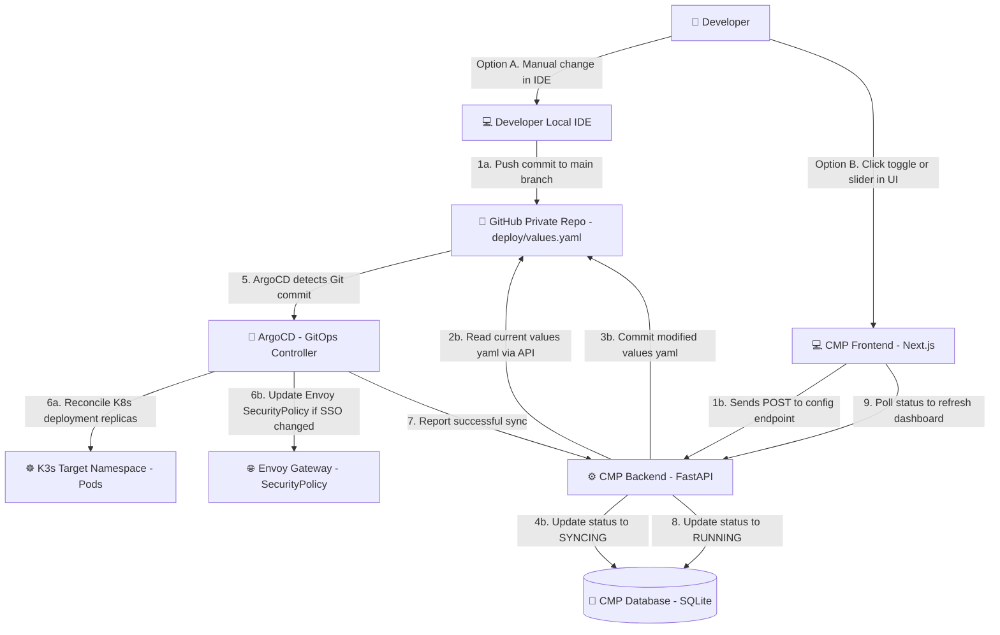

# Developer Configuration & GitOps Flow

To achieve true self-service infrastructure without overwhelming developers with Kubernetes complexities, CNP relies on a "Pure GitOps" configuration model. 

The contract between the developer and the platform is a single, simplified `values.yaml` file located in the application's repository.

## 1. The GitOps Paradigm
In the CNP ecosystem, **Git is the absolute Single Source of Truth (SSOT)**. 

Neither the developer nor the Cloud Management Platform (CMP) interacts directly with the Kubernetes API to change application states (like scaling replicas or exposing ports). All changes must pass through Git.

### The Two Ways to Update Infrastructure
1. **Developer-Driven (Code):** The developer edits the `values.yaml` file in their IDE and pushes to GitHub.
2. **UI-Driven (CMP Dashboard):** The developer uses the CMP web interface (e.g., moving a slider to increase replicas). The CMP backend uses the GitHub App API to automatically create a commit in the developer's repository.

In both scenarios, **ArgoCD** detects the change in the Git repository and applies the state to the K3s cluster.

---

## 2. The Configuration Interface (`values.yaml`)

When the CMP provisions a new application from a "Git App Template", it injects a highly curated `deploy/values.yaml` file. 

This file overrides the defaults of the "Generic Microservice Helm Chart". It exposes only the variables that the developer needs to care about, abstracting away complex Kubernetes resources (Services, Ingresses, NetworkPolicies, VaultSecrets).

**Example of the generated `deploy/values.yaml`:**
```yaml
# ==============================================================================
# 🚀 CNP Application Configuration
# ==============================================================================
# This file is the source of truth for your application's infrastructure.
# You can edit these values manually or via the CMP Dashboard.
# ArgoCD will automatically apply changes to the cluster.

# -- Number of application pods running simultaneously
replicaCount: 2

# -- Container Image (Automatically updated by CI/CD & ArgoCD Image Updater)
image:
  repository: ghcr.io/my-org/my-app
  tag: "sha-a1b2c3d" # DO NOT EDIT MANUALLY

# -- Compute Resources (CPU & Memory)
resources:
  requests:
    cpu: 250m
    memory: 256Mi
  limits:
    memory: 512Mi

# -- Networking & Edge Security
ingress:
  enabled: true
  # If true, Envoy Gateway will enforce Keycloak SSO authentication
  sso_protected: false

# -- Environment Variables
env:
  NODE_ENV: "production"
  LOG_LEVEL: "info"

# Note: Sensitive secrets should not be placed here.
# They are automatically injected by the Vault Secrets Operator 
# via the 'secrets' Vault path assigned to your project.
```

---

## 3. Day-0: Initial Provisioning
When the developer clicks "Deploy" in the CMP Catalog:
1. The CMP collects the initial form inputs (App Name, Replicas, SSO toggle).
2. The CMP's Terraform executor dynamically generates the `deploy/values.yaml` file using a template function.
3. Terraform commits this file as the very first commit to the newly created private GitHub repository.
4. ArgoCD performs the initial sync.

---

## 4. Day-2: Operations via the CMP Dashboard

To provide a modern PaaS experience, developers can manage their app via the CMP Web UI.

**The Update Sequence:**
```text
[ Developer UI ] 
      | 1. Clicks "Enable SSO" in the App Dashboard
      v
[ CMP Backend (FastAPI) ]
      | 2. Fetches current values.yaml from GitHub API
      | 3. Parses YAML, sets `ingress.sso_protected = true`
      | 4. Commits and pushes the updated YAML back to GitHub
      v
[ GitHub Repository ]
      | 5. Triggers Webhook / ArgoCD Poll
      v
[ ArgoCD ]
      | 6. Detects drift in values.yaml
      | 7. Renders the Generic Helm Chart with new values
      | 8. Patches the Envoy SecurityPolicy CRD in Kubernetes
      v
[ K3s Cluster ] (App is now secured by SSO)
```

### Advantages of this approach:
- **No Configuration Drift:** Because the CMP writes to Git instead of the K8s API, the CMP and the Git repository are never out of sync.
- **Auditability:** Every infrastructure change made via the CMP results in a Git commit. The commit history acts as a perfect audit log (e.g., `"CMP: Scaled replicas from 2 to 4"`).
- **Rollback Capability:** If a user breaks their app via the CMP, they can simply revert the Git commit, or click "Rollback" in the CMP (which just reverts the last commit via the GitHub API).

