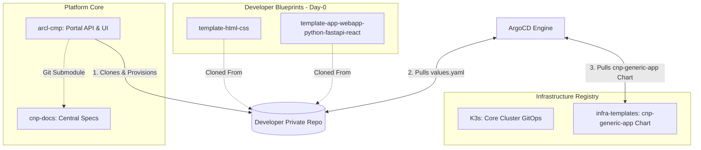

# GitHub Repositories Landscape

The CNP platform adopts a highly modular **Multi-Repository Architecture** to enforce a clean separation of concerns. This ensures that platform source code, infrastructure declarations, and reusable developer blueprints are isolated into specialized repositories.

---

## 1. Repository Interaction Topology

The diagram below maps how core platform components, central registries, and developer blueprints interact during bootstrap and runtime operations.

---

## 2. Platform Core Repositories

These repositories house the administrative interfaces, central orchestration engines, and global configuration states of the platform.

### A. `arcl-cmp` (The Portal)
* **Purpose**: Houses the FastAPI backend API and the Next.js frontend IDP dashboard.
* **Role**: Coordinates the SAGA orchestrator and handles external API calls to Keycloak, Vault, and GitHub.
* **Status**: WIP. Undergoing refactoring to natively support the `Project > Application` data model and token exchanges.

### B. `cnp-docs` (The Specs)
* **Purpose**: Houses these technical specifications.
* **Role**: Integrated into the CMP Backend as a **Git Submodule** to allow AI-assisted developer agents (like Kiro) to read fresh architectural specifications on the fly.
* **Status**: Complete & Production Ready.

### C. `K3s` (The Cluster Infrastructure)
* **Purpose**: The master GitOps repository for K3s infrastructure.
* **Role**: Hosts the base configurations of the cluster, applying the "App of Apps" pattern to bootstrap systems like Cilium, Envoy Gateway, Vault Secrets Operator, Cert-Manager, and Kyverno.
* **Status**: Active & Managed.

---

## 3. Application Templates (Day-0 Blueprints)

These repositories are treated as immutable blueprints. The CMP clones them to spin up new repositories for developers.

### A. `template-html-css`
* **Purpose**: Bare-minimum boilerplate for static, light-weight landing pages.
* **Role**: Contains raw `index.html`, `styles/style.css`, a standard Alpine Nginx `Dockerfile`, and the GitOps `deploy/values.yaml` contract.
* **Status**: Active.

### B. `template-app-webapp-python-fastapi-react`
* **Purpose**: Full-stack, multi-tier boilerplate for robust web applications.
* **Role**: Contains distinct `src/frontend` (React + Vite) and `src/backend` (FastAPI) directories, multi-stage Dockerfiles, and independent `values-frontend.yaml` / `values-backend.yaml` configurations.
* **Status**: Active.

---

## 4. Kubernetes Delivery Repositories (Day-1 & Day-2)

### A. `infra-templates`
* **Purpose**: Centralized Helm Registry.
* **Role**: Hosts the single, highly parameterized `cnp-generic-app` Helm chart. All developer Git repositories point to this chart inside their ArgoCD `Application` configurations, pulling values dynamically from their local directories.
* **Status**: Active.

---
**Next Step**: Continue to [Git App Templates & Bootstrapping Specifications](01-git-app-templates.md) (or return to the [Project Overview](../README.md)).