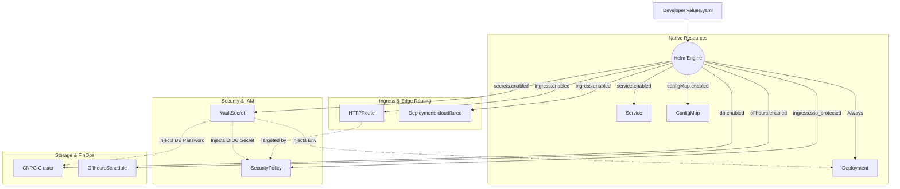
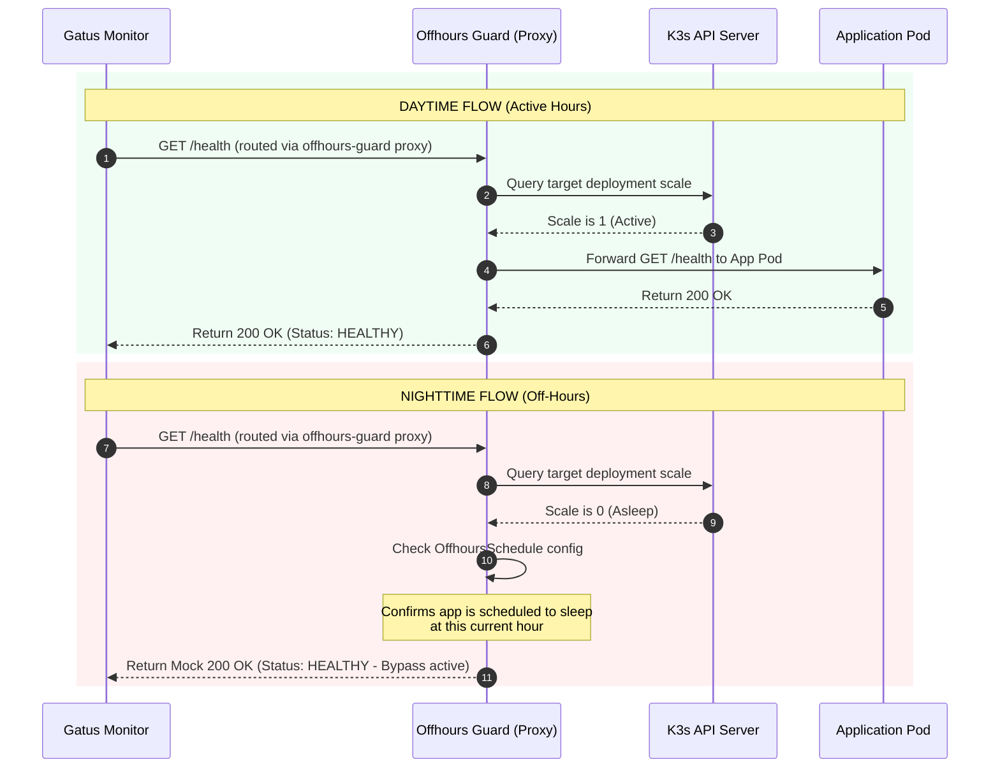

# Central Generic Helm Chart (`cnp-generic-app`)

## 1. Overview
Rather than maintaining custom, duplicate Kubernetes manifests for every single application, CNP relies on a single **Generic Helm Chart** named `cnp-generic-app` (located in the `infra-templates` repository). 

This chart acts as a declarative rendering engine. It accepts a simplified `values.yaml` from the developer's private Git repository, evaluates conditional Go template logic, and compiles it into standard Kubernetes resources and Custom Resource Definitions (CRDs) handled by cluster operators.

---

## 2. Resource Compilation Topology

The diagram below shows how a single, developer-controlled `values.yaml` file is compiled by Helm into a complex, inter-connected mesh of native and custom K8s resources.



---

## 3. Core Component Specifications

### A. Compute & Configurations (`deployment.yaml` & `configmap.yaml`)
The core of the application lifecycle resides in the native `Deployment`. 
* **Environment Variables**: Dynamically mapped using the `.Values.env` list.
* **Secret Injection**: If `secrets.enabled` is `true`, the deployment automatically mounts the output of the Vault Secrets Operator using an `envFrom` block pointing to the generated secret:
  ```yaml
  # templates/deployment.yaml extract
  envFrom:
    - secretRef:
        name: {{ include "cnp-generic-app.fullname" . }}-secrets
  ```

---

### B. Secrets Isolation (`vaultsecret.yaml`)
When an application requires sensitive configurations (API keys, database passwords), the chart deploys a `VaultSecret` CRD managed by the `vault-secrets-operator`.
* **Sync Wave**: Annotated with `argocd.argoproj.io/sync-wave: "-1"` to guarantee the secrets are decrypted and created in the namespace *before* the main deployment attempts to start.
* **VSO Mapping**:
  ```yaml
  apiVersion: ricoberger.de/v1alpha1
  kind: VaultSecret
  metadata:
    name: {{ include "cnp-generic-app.fullname" . }}-secrets
    namespace: {{ .Release.Namespace }}
  spec:
    path: {{ .Values.secrets.vaultPath }}
    vaultRole: {{ .Values.secrets.vaultRole | default (printf "%s-role" .Release.Namespace) }}
    type: Opaque
  ```

---

### C. Edge Routing & Gateway API (`httproute.yaml`)
Traffic ingress is handled via the modern Kubernetes Gateway API (`gateway.networking.k8s.io/v1`).
* **Gateway Binding**: The route binds directly to the cluster's pre-configured `shared-gateway` inside the `gateway-infra` namespace.
* **Dynamic Target**: Traffic is mapped to port `80` of the native `Service` matching the application name.

---

### D. Edge SSO & OpenID Connect (`securitypolicy.yaml`)
When `ingress.sso_protected: true` is configured, the chart deploys an Envoy Gateway `SecurityPolicy` to enforce OpenID Connect (OIDC) at the cluster edge.
* **Envoy Integration**: It directly targets the application's `HTTPRoute`.
* **Credential Flow**: It retrieves the Keycloak client secret directly from the synced `VaultSecret` object (`{{ include "cnp-generic-app.fullname" . }}-secrets`), ensuring no secrets are exposed.
* **Tenant Isolation**: The OIDC issuer is dynamically configured to point to the project-specific Keycloak realm:
  ```yaml
  # templates/securitypolicy.yaml extract
  spec:
    targetRefs:
      - group: gateway.networking.k8s.io
        kind: HTTPRoute
        name: {{ include "cnp-generic-app.fullname" . }}-route
    oidc:
      provider:
        issuer: "https://auth.3istor.com/realms/{{ .Values.ingress.realm }}"
  ```

---

## 4. Advanced Operational Pipelines

### A. Gatus / Offhours Auto-Discovery Bypass Flow
To save energy and cloud costs, applications can be scheduled to sleep outside working hours (`offhours.enabled: true`). However, scaling a deployment to `0` replicas ordinarily causes Gatus to trigger high-severity outage alerts. 

CNP solves this by intercepting Gatus monitoring requests through the `offhours-guard` controller.

#### Gatus Bypass Sequence Diagram:



#### Annotation Logic
To support this behavior without manual configuration, the chart dynamically computes Gatus annotations depending on whether the app is public (uses Ingress/HTTPRoute) or strictly internal (Service only):

```yaml
# templates/httproute.yaml Gatus annotation logic
annotations:
  gatus.3istor.com/{{ .Values.project_name }}-enabled: "true"
  gatus.3istor.com/{{ .Values.project_name }}-endpoint: |
    group: "Applications"
    {{- if .Values.offhours.enabled }}
    url: "http://offhours-guard.{{ .Values.project_name }}-system.svc.cluster.local:8082/health/{{ .Release.Namespace }}/{{ include "cnp-generic-app.fullname" . }}?port={{ (index .Values.service.ports 0).port }}&path={{ .Values.monitoring.path | default "/" }}"
    {{- else }}
    url: "https://{{ .Values.ingress.hostname }}{{ .Values.monitoring.path | default "/" }}"
    {{- end }}
    conditions:
      - "[STATUS] == 200"
```

---

### B. Database Provisioning & Garage S3 Backups (CNPG)
When `db.enabled: true` is configured, the chart deploys a CloudNativePG (CNPG) postgres cluster. To survive physical node or site failures, the database is configured for continuous WAL archiving and automated daily backups on local **Garage S3** buckets.

#### Database Archiving Architecture:

```text
  [ HashiCorp Vault ]
          │ (Decrypts Credentials)
          ▼
   [ VaultSecret ]
          │ (Syncs K8s Secret)
          ▼
   [ CNPG Cluster ] ──(Continuous WAL Archiving)──► [ Garage S3 Bucket ]
  (db-secrets / s3-creds)                             (s3.3istor.com)
```

#### CNPG Cluster Resource Mapping:
```yaml
apiVersion: postgresql.cnpg.io/v1
kind: Cluster
metadata:
  name: {{ include "cnp-generic-app.fullname" . }}-db
  namespace: {{ .Release.Namespace }}
spec:
  instances: 1
  
  # Credentials matching the synced Vault secret
  bootstrap:
    initdb:
      database: {{ .Values.db.name | default .Values.app_name }}
      owner: app
      secret:
        name: {{ include "cnp-generic-app.fullname" . }}-secrets

  # Persistent Storage
  storage:
    size: {{ .Values.db.storage | default "1Gi" }}
    storageClass: local-path

  # Continuous Archiving to S3
  backup:
    barmanObjectStore:
      destinationPath: "s3://database-backups/{{ .Values.project_name }}/{{ .Values.app_name }}"
      endpointURL: "https://s3.3istor.com"
      s3Credentials:
        name: {{ include "cnp-generic-app.fullname" . }}-secrets # Uses the Vault-synced secret
```

---

## 5. Handling Multi-Tier Applications (e.g., React + FastAPI)

The `cnp-generic-app` chart is designed to deploy **one deployable unit (container)** at a time. 
For complex architectures like the `template-app-webapp-python-fastapi-react` stack, the CMP provisions **multiple ArgoCD Applications**, all pointing to this exact same Helm chart, but feeding it different values files.

### The Multi-Tier GitOps Setup

In a full-stack repository, the `deploy/` folder looks like this:
```text
deploy/
├── values-frontend.yaml  (React)
└── values-backend.yaml   (FastAPI)
```

**Backend Instantiation (`values-backend.yaml`):**
* `image.repository`: `ghcr.io/3-istor/[app]/backend`
* `service.ports.targetPort`: `8000`
* `ingress.enabled`: `false` (Internal API only)
* `secrets.enabled`: `true` (Needs DB connection string from Vault)
* `db.enabled`: `true` (Provisions the Postgres Cluster)

**Frontend Instantiation (`values-frontend.yaml`):**
* `image.repository`: `ghcr.io/3-istor/[app]/frontend`
* `service.ports.targetPort`: `3000`
* `ingress.enabled`: `true` (Public facing website)
* `ingress.sso_protected`: `true` (Protected by Keycloak)
* `secrets.enabled`: `false` (Static React app needs no secrets)
* `db.enabled`: `false`

*ArgoCD independently renders the `cnp-generic-app` chart twice, securely linking the frontend to the edge gateway and the backend to the database, achieving total separation of concerns without writing custom Helm subcharts.*

---
**Next Step**: Continue to [Project Base Infrastructure Chart](03-project-base-chart.md) (or return to the [Project Overview](../README.md)).