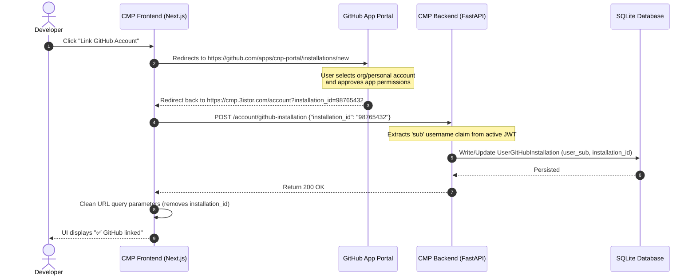

# Account & GitHub Integration API Contract

The Account API manages authenticated user sessions, profile photo storage (Garage S3), and orchestrates the critical GitHub App link sequence.

---

## 1. Get Current User Profile

Retrieves the active profile of the authenticated user. Name, email, and groups are validated against the JWT token, while profile pictures and GitHub integrations are dynamically cross-referenced from Keycloak and the database.

* **HTTP Method**: `GET`
* **Path**: `/api/account/me`
* **Authorization**: Requires a valid Bearer JWT.
* **Response (`200 OK`)**:

```json
{
  "sub": "8ca5e72a-8d85-460d-5a3f-a69b8745237f",
  "email": "brian.perret@epita.fr",
  "given_name": "Brian",
  "family_name": "Perret",
  "name": "Brian Perret",
  "picture": "https://avatars-s3.3istor.com/brian.perret.jpg",
  "groups": [
    "project-alpha-admins",
    "member"
  ],
  "github_installation_id": "98765432"
}
```

---

## 2. Upload Profile Picture

Uploads an image file to the local Garage S3 storage and automatically updates the user's `picture` attribute in Keycloak.

* **HTTP Method**: `POST`
* **Path**: `/api/account/picture`
* **Content-Type**: `multipart/form-data`
* **File Constraints**: JPG, PNG, GIF, or WEBP only. Max size: 5 MB.
* **Payload**: Form-data with a `file` field containing the binary image.

### Example Request
```bash
curl -X POST "https://cmp.3istor.com/api/account/picture" \
  -H "Authorization: Bearer eyJhbGci..." \
  -F "file=@/path/to/avatar.jpg"
```

**Expected Response (`200 OK`)**:
```json
{
  "message": "Profile picture updated successfully",
  "picture_url": "https://avatars-s3.3istor.com/brian.perret.jpg"
}
```

---

## 3. Save GitHub Installation ID

Links the developer's profile to a GitHub App installation ID. This is called automatically by the UI upon callback redirect, or manually through settings.

* **HTTP Method**: `POST`
* **Path**: `/api/account/github-installation`
* **Request Payload (`GitHubInstallationRequest`)**:

```json
{
  "installation_id": "98765432"
}
```

### Example Request
```bash
curl -X POST "https://cmp.3istor.com/api/account/github-installation" \
  -H "Authorization: Bearer eyJhbGci..." \
  -H "Content-Type: application/json" \
  -d '{
    "installation_id": "98765432"
  }'
```

**Expected Response (`200 OK`)**:
```json
{
  "message": "GitHub installation ID saved successfully",
  "installation_id": "98765432"
}
```

---

## 🔄 The User-to-GitHub Integration Lifecycle

The GitHub linking sequence involves a handshake between the client browser, GitHub, and the CMP Backend:



---
**Next Step**: Return to the [Project Overview](../README.md).
