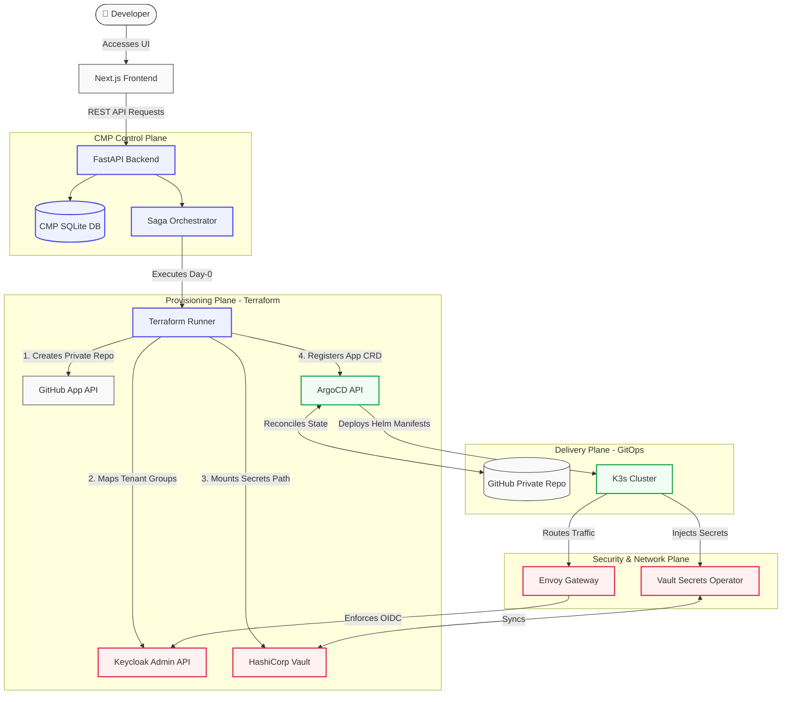

# Cloud Native Platform (CNP) ⚡ - Documentation

## 📖 Project Overview

The Cloud Native Platform (CNP) is a modern **Internal Developer Portal (IDP)** designed to completely abstract infrastructure complexity. It empowers developers to provision, manage, and monitor containerized applications on Kubernetes through standardized "Golden Paths".

Built on top of a highly robust stack (Next.js, FastAPI, Kubernetes, ArgoCD, Terraform, Vault, and Keycloak), CNP shifts the paradigm from traditional IaaS (VM deployment) to modern PaaS/CaaS (Platform/Container as a Service).

## 🎯 Core Objectives

1. **Developer Autonomy:** Self-service provisioning of full-stack applications via a visual dashboard (CMP) or a GitOps configuration file (`cnp.yaml`).
2. **Strict Multi-Tenancy:** A hierarchical `Project > Application` model ensuring absolute isolation (Network, Secrets, RBAC) between different teams.
3. **End-to-End Automation:** Seamless integration from GitHub repository creation, CI/CD bootstrapping, Kubernetes deployment (Helm + ArgoCD), to DNS and Secret injection.

---

## 🔗 Core URLs

### Production Environments
* **CMP Dashboard**: `https://cmp.3istor.com`
* **Keycloak (IdP)**: `https://auth.3istor.com`
* **HashiCorp Vault**: `https://vault.3istor.com`
* **ArgoCD**: `https://argocd.3istor.com`

### Local Development
* **Frontend UI**: `http://localhost:3000`
* **Backend API Docs (Swagger)**: `http://localhost:8000/docs`
* **Local API Base**: `http://localhost:8000/api`

---

## 📚 Documentation Directory

This repository contains the architectural decisions, workflows, and specifications of the CNP ecosystem. It is structured for both human engineers and AI assistants to quickly grasp the system design.

- **[01. Architecture & Topologies](./01-architecture/)**: System overviews, Tenancy models, and Networking.
- **[02. Core Components](./02-core-components/)**: Deep dives into the CMP, Keycloak, Vault, and ArgoCD configurations.
- **[03. Pipelines & Workflows](./03-pipelines-and-workflows/)**: Sequential flows for app provisioning, CI/CD, and the `cnp.yaml` GitOps cycle.
- **[04. Templates Design](./04-templates/)**: Specifications for Git App Templates, Generic Helm Charts, and Terraform wrappers.
- **[05. CMP Backend API](./05-cmp-backend-api/)**: ⭐ **NEW** - API specifications and integration guides for the Cloud Management Platform.

## 📋 Project Documentation

- **[CHANGELOG.md](../CHANGELOG.md)**: Version history and release notes
- **[README_ROADMAP.md](./README_ROADMAP.md)**: Implementation roadmap and phase tracking
- **[PHASE3_TEAM_HANDOFF.md](../PHASE3_TEAM_HANDOFF.md)**: Team handoff document for Phase 3
- **[PHASE3_SUMMARY.md](../PHASE3_SUMMARY.md)**: Quick summary of Phase 3 changes

```
cnp-docs/
├── README.md                               # Project pitch and documentation index
├── README_ROADMAP.md                       # Implementation roadmap
├── 01-architecture/
│   ├── 01-system-overview.md               # Global architecture (Frontend, Backend, K8s, Git)
│   ├── 02-tenancy-and-isolation.md         # Project > App model (RBAC, Network, Vault)
│   └── 03-network-topology.md              # Envoy Gateway, Cilium, Ingress, DNS
├── 02-core-components/
│   ├── 01-cmp-dashboard.md                 # Frontend/Backend specifications
│   ├── 02-identity-keycloak.md            # SSO flows, Groups, OIDC
│   ├── 03-secrets-vault.md                # Secrets management, VSO
│   ├── 04-gitops-argocd.md                 # Cluster synchronization
│   ├── 05-github-integration.md           # Dedicated GitHub App Model integration
│   └── 06-database-schema.md              # Database schemas, ERD, and WAL mode
├── 03-pipelines-and-workflows/
│   ├── 01-app-provisioning-flow.md       # App creation sequence (Terraform -> Git -> ArgoCD)
│   ├── 02-ci-cd-pipelines.md             # GitHub Actions (Build, Push)
│   ├── 03-developer-cnp-yaml.md          # cnp.yaml spec and translation
│   └── 04-system-flows.md                # Sequence diagrams for core platform workflows
├── 04-templates/
│   ├── 01-git-app-templates.md           # Application repository structure
│   ├── 02-helm-umbrella-chart.md         # Generic Helm chart
│   └── 03-terraform-provisioner.md       # Terraform for infra and GitHub initialization
└── 05-cmp-backend-api/                    # ⭐ NEW - CMP API Documentation
    ├── 00-global-api-standards.md         # API Specification: Global Standards & Authentication
    ├── 01-cmp-deployment-api.md           # Deployment API specification
    ├── 02-cmp-phase3-changes.md           # Phase 3 changes summary
    ├── 03-cmp-frontend-integration.md     # Frontend integration guide
    ├── 04-cmp-projects-api.md             # Projects & RBAC API specification
    ├── 05-cmp-catalog-api.md              # Catalog API specification
    ├── 06-cmp-infra-api.md                # Infrastructure & Health API specification
    ├── 07-cmp-account-api.md              # Account & GitHub link API specification
    ├── 08-cmp-local-development.md        # Local development specifications
    ├── 09-cmp-containers.md               # Containerization & Docker Compose setup
    └── 10-cmp-onboarding-runbook.md       # Onboarding checklist & test run scenarios
```

---

## 🏛️ High-Level Architecture Overview

CNP decouples user intent from infrastructure creation. It operates as an **Orchestrator of Orchestrators**, treating Git repositories as the Single Source of Truth (SSOT).



---

## 🔭 Project Scope boundaries

The scope of CNP is explicitly defined to maintain architectural separation.

### Supported Features
* **Multi-Provider Provisioning**: Day-0 automation for K3s-GitOps stacks alongside legacy AWS/OpenStack VMs.
* **Granular Identity Federations**: Mapping of project administrators and members into Keycloak groups, with downstream OIDC propagation to ArgoCD, Vault, and Envoy Gateway.
* **Day-2 GitOps Write-Back**: Performing modifications to live resources (such as scaling replica counts) exclusively by committing parsed YAML modifications to Git.
* **Auto-Sleep Scheduling**: Automated platform-wide cluster resources conservation during off-hours (`OffhoursSchedule`).
* **Self-Healing Secrets Pipeline**: Automatic syncing of newly generated application secrets from Vault to Kubernetes native secrets using the Vault Secrets Operator.

### Non-Supported Features
* **Direct Kubernetes Mutations**: The CMP Backend does not communicate with the Kubernetes API server directly to deploy application workloads.
* **Source Code Compilation**: The platform is agnostically decoupled from compilation or runtime code execution. It relies on GitHub Actions to generate container images.
* **Host-Level Network Configurations**: Underlying cluster routing, VPN routing (WireGuard), and CNI (Cilium) deployments must be bootstrapped before the application lifecycle begins.
