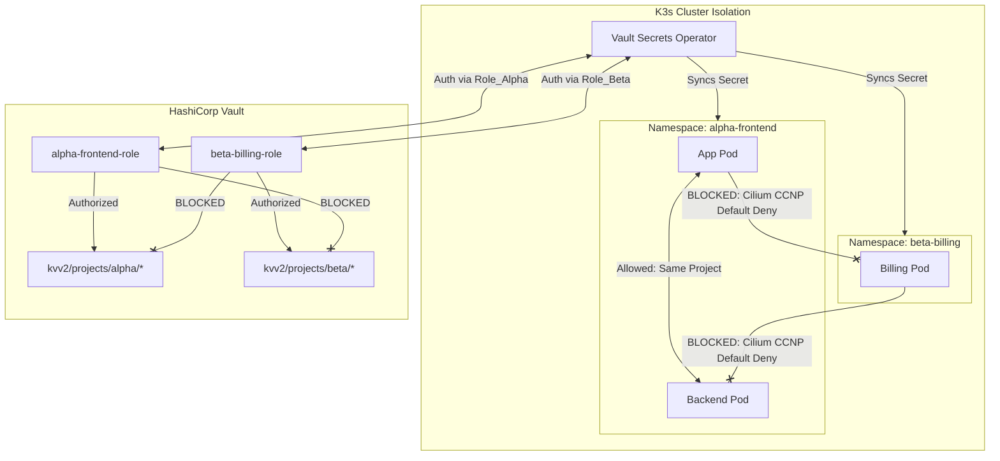

# Multi-Tenancy & Isolation Model

CNP implements strict multi-tenancy across all operational planes. It leverages native Kubernetes boundaries, advanced Cilium CNI network controls, and integrated identity federation (Keycloak, Vault, and Envoy Gateway).

---

## 1. Hierarchy Definitions & Mappings

The platform maps team boundaries (Projects) to isolated cluster boundaries (Applications) using a strict hierarchical model:

```text
  [ Project (Team Boundary) ]  ◄── Matches Keycloak Parent Group / Vault Policy
              │
              ├── [ Application A ]  ◄── Namespace: project-appA / ArgoCD Application
              └── [ Application B ]  ◄── Namespace: project-appB / ArgoCD Application
```

| Dimension | Logical Scope (Project) | Physical Scope (Application) |
| :--- | :--- | :--- |
| **ArgoCD** | `AppProject` (Governance sandbox) | `Application` (Reconciliation runner) |
| **Keycloak** | Parent Group (`project-alpha-admins`) | Client ID (`cnp-alpha-frontend`) |
| **HashiCorp Vault** | Isolated KV Path (`kvv2/projects/alpha/`) | Kubernetes Auth Role (`alpha-frontend-role`) |
| **Kubernetes** | Network Policy (`CiliumClusterwideNetworkPolicy`) | Dedicated `Namespace` (`alpha-frontend`) |

---

## 2. Multi-Tenant Security Boundaries



---

## 3. Network Isolation (Cilium CNI)

By default, Kubernetes namespaces allow unrestricted cross-pod communication. CNP completely isolates tenant networks using a `CiliumClusterwideNetworkPolicy` (CCNP).

### The Tenant CCNP Specification:
This policy enforces a "Default Deny" posture for cross-namespace communication, while dynamically allowing intra-project communication using label selectors.

```yaml
apiVersion: "cilium.io/v2"
kind: CiliumClusterwideNetworkPolicy
metadata:
  name: "tenant-isolation-policy"
spec:
  # Targets all pods residing inside any tenant application namespace
  endpointSelector:
    matchLabels:
      managed-by: "cnp"
  
  ingress:
    # Rule 1: Allow communication only from pods inside the SAME project
    - fromEndpoints:
        - matchExpressions:
            - key: "project"
              operator: In
              values:
                - "{{ .Values.project_name }}" # Injected dynamically
                
    # Rule 2: Allow ingress from the shared Envoy Gateway proxy
    - fromEndpoints:
        - matchLabels:
            io.kubernetes.pod.namespace: "gateway-infra"
            app.kubernetes.io/name: "envoy-gateway"

  egress:
    # Rule 1: Allow egress only to pods inside the SAME project
    - toEndpoints:
        - matchExpressions:
            - key: "project"
              operator: In
              values:
                - "{{ .Values.project_name }}"
                
    # Rule 2: Allow DNS resolution to CoreDNS in kube-system
    - toEndpoints:
        - matchLabels:
            io.kubernetes.pod.namespace: "kube-system"
            k8s-app: "kube-dns"
      toPorts:
        - ports:
            - port: "53"
              protocol: UDP
```

---

## 4. Access Control & Edge Security (Keycloak & Envoy Gateway)

Edge security is enforced at the network proxy layer, eliminating the need for developers to embed authentication logic inside their application code.

1. **Authentication Handshake**: Envoy Gateway terminates incoming TLS connections at the edge.
2. **SecurityPolicy Binding**: If `sso_protected: true` is enabled in `values.yaml`, Envoy intercepts the route using an OIDC filter.
3. **Keycloak Validation**: Envoy redirects unauthenticated users to Keycloak.
4. **Token Verification**: Keycloak mints a JWT token on success. Envoy verifies the signature and checks that the user's `groups` claim contains either the `project-<project_name>-members` or `project-<project_name>-admins` roles before forwarding the HTTP request to the target pod.

---

## 5. Secrets Isolation (HashiCorp Vault & VSO)

Secrets are isolated at rest inside Vault and synchronized dynamically into Kubernetes using the `vault-secrets-operator`.

### A. Vault Policy Configuration
Every project receives a dedicated, non-escalable Vault policy restricting write/read capabilities to its specific path:

```hcl
# project-alpha-policy
path "kvv2/data/projects/alpha/*" {
  capabilities = ["create", "read", "update", "delete", "list"]
}
path "kvv2/metadata/projects/alpha/*" {
  capabilities = ["list", "read"]
}
```

### B. Kubernetes Auth Role Binding
To prevent the Vault Secrets Operator (VSO) from fetching secrets belonging to other projects, Terraform configures a highly scoped `vault_kubernetes_auth_backend_role` for each application.

This role requires the VSO to present a service account token residing strictly within the target application's namespace, verifying the namespace boundary before releasing decrypted values:

```hcl
# Terraform-generated Vault Auth Role
resource "vault_kubernetes_auth_backend_role" "app_role" {
  backend                          = "kubernetes"
  role_name                        = "alpha-frontend-role"
  bound_service_account_names      = ["vault-secrets-operator"]
  bound_service_account_namespaces = ["alpha-frontend"] # Hard boundary
  token_ttl                        = 3600
  token_policies                   = ["project-alpha-policy"]
}
```
---
**Next Step**: Continue to [Network Topology & Infrastructure Specifications](03-network-topology.md) (or return to the [Project Overview](../index.md)).