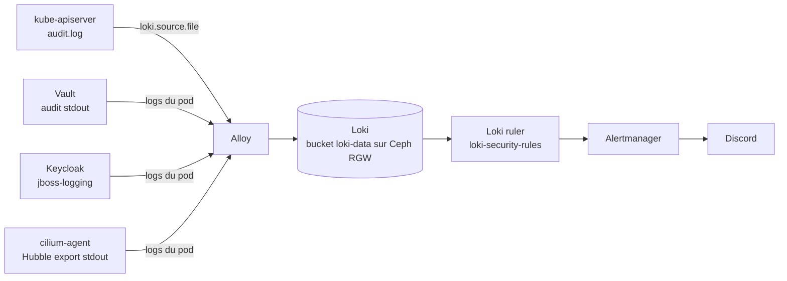

# Journaux d'audit

Qui a fait quoi sur la plateforme, et qui est prévenu quand ça compte. Quatre sources
écrivent une trace, Alloy les envoie toutes dans Loki, et le ruler de Loki alerte Discord
à travers Alertmanager.

| Source | Ce qui est tracé | Où c'est configuré | Rétention |
|---|---|---|---|
| API Kubernetes | Requêtes des personnes et des tokens : `exec`, lecture de secrets, écritures, RBAC | `K3s/node-config/k3s-server/audit-policy.yaml` | 30 j |
| Vault | Chaque requête et réponse, secrets hachés en HMAC | `K3s/terraform/audit.tf` (`vault_audit.stdout`) | 30 j |
| Keycloak | Logins, échecs, admin events, sur tous les realms | `K3s/terraform/audit.tf`, `project-bootstrap`, `cnp-project-base` | 30 j |
| Cilium (Hubble) | Flux refusés par une network policy | `K3s/k8s/config/kube-system/values.yaml` | 14 j |

Chaque heure d'audit Kubernetes, Vault et Keycloak est en plus copiée dans un bucket verrouillé 30 jours (voir [Archive immuable](#archive-immuable)).



## Cycle de vie d'une politique d'audit Kubernetes

La politique est un fichier `audit.k8s.io/v1` `Policy` que l'API server applique à chaque
requête. Seul le serveur K3s en a une : l'API server tourne dans le process `k3s server`,
le worker (`k3s agent`) ne reçoit aucune requête d'API. En HA, chaque serveur aurait la
sienne.

1. **Chargement.** L'API server lit le fichier une fois, au démarrage
   (`--audit-policy-file`). Pas de rechargement à chaud : toute modification demande un
   `systemctl restart k3s`. Un fichier invalide empêche l'API de démarrer, d'où la
   validation avant chaque déploiement (voir plus bas).
2. **Stages.** Une requête produit un event à chaque étape : `RequestReceived`,
   `ResponseStarted` (requêtes longues, `watch`), `ResponseComplete`, `Panic`. On omet
   `RequestReceived` pour ne pas écrire deux lignes par requête.
3. **Choix de la règle.** Les règles sont lues de haut en bas ; la première qui
   correspond (utilisateur, groupe, verbe, ressource, namespace, URL) fixe le niveau. Les
   exclusions vont donc en tête et la règle générale tout en bas.
4. **Niveaux.**
   - `None` : rien.
   - `Metadata` : qui, quoi, quand, depuis où, code de retour.
   - `Request` : en plus, le corps de la requête.
   - `RequestResponse` : en plus, le corps de la réponse.

   Ne jamais dépasser `Metadata` sur les secrets : leur contenu finirait en clair dans les logs.
5. **Backend.** Un event JSON par ligne dans
   `/var/lib/rancher/k3s/server/logs/audit.log`. Ce fichier n'est qu'un tampon (100 Mo,
   3 rotations, 2 jours) : Alloy le lit sur le nœud serveur et l'envoie à Loki avec
   `job="k8s-audit"`.

Un event réel, un `kubectl exec` :

```json
{
  "kind": "Event",
  "level": "Metadata",
  "stage": "ResponseComplete",
  "requestURI": "/api/v1/namespaces/observability/pods/loki-0/exec?command=%2Fusr%2Fbin%2Floki&command=--version&container=loki&stderr=true&stdout=true",
  "verb": "get",
  "user": { "username": "system:admin", "groups": ["system:masters", "system:authenticated"] },
  "sourceIPs": ["192.168.1.110"],
  "userAgent": "kubectl/v1.36.3 (linux/amd64) kubernetes/0f29094",
  "objectRef": { "resource": "pods", "namespace": "observability", "name": "loki-0", "subresource": "exec" },
  "responseStatus": { "code": 101 },
  "annotations": { "authorization.k8s.io/decision": "allow" }
}
```

La commande lancée est dans `requestURI`. Le verbe est `get` : depuis le passage de
`kubectl exec` aux WebSockets, l'upgrade HTTP arrive en GET.

## Notre politique, règle par règle

L'objectif : tout ce qu'une personne ou un token volé peut faire, rien de ce que les
controllers font en boucle. En régime normal, cela donne environ 30 Ko par minute.

| # | Niveau | Ce qui correspond | Pourquoi |
|---|---|---|---|
| 1 | None | `kube-proxy`, scheduler, controller-manager, `system:apiserver`, cloud controller, `system:k3s-*` | Bruit du control plane |
| 2 | None | Groupes `system:nodes` et `system:serviceaccounts:kube-system` | Kubelets et controllers intégrés (endpoints, replicasets…) |
| 3 | None | `/healthz`, `/readyz`, `/livez`, `/version`, `/metrics`, `/openapi` | Sondes et découverte |
| 4 | None | `events`, `leases` | Écrits en continu, aucune valeur d'audit |
| 5 | None | Verbe `watch` | Connexions longues des controllers |
| 6 | None | Groupes `authorization.k8s.io`, `authentication.k8s.io` | SubjectAccessReview et TokenReview, émis par chaque webhook et opérateur |
| 7 | None | Argo CD controller sur `applications` | Il écrit le statut de chaque Application à chaque réconciliation |
| 8 | None | Service accounts sur les rapports Kyverno, Trivy, `wgpolicyk8s.io` et sur les ImageUpdaters | Résultats d'outils réécrits à chaque passe |
| 9 | None | Kyverno sur ses propres webhooks | Rafraîchissement périodique |
| 10 | Metadata | `pods/exec`, `pods/attach`, `pods/portforward`, service accounts compris | Un shell dans un pod est toujours notable. Placée avant la règle 11 parce qu'un exec arrive en `get` |
| 11 | None | `get` et `list` par un service account | Les controllers lisent tout le cluster en permanence ; ce qu'ils lisent est borné par leur RBAC. Leurs écritures restent tracées |
| 12 | Metadata | `secrets`, `configmaps`, `serviceaccounts/token` | Qui les a touchés, jamais leur contenu |
| 13 | Request | Écritures sur `rbac.authorization.k8s.io` | Voir la permission accordée, pas seulement qu'il y en a eu une |
| 14 | Metadata | Tout le reste | Règle générale |

Ce que la politique ne voit pas, volontairement : un service account qui lit des secrets
dans le cadre de ses droits. Le compromis est assumé : ces lectures étaient la première source
de volume, trivy-operator en tête. Un token volé qui *écrit*, ouvre un shell ou touche au RBAC reste
tracé.

## Alertes

Règles Loki dans `K3s/k8s/config/observability/loki-security-rules.yaml`, chargées par le
sidecar dans `/rules/default` (le seul tenant Loki) et évaluées chaque minute.

| Alerte | Sévérité | Déclenchée par | Bruit attendu |
|---|---|---|---|
| `VaultRootTokenUsed` | warning | Une requête Vault avec la policy `root` | Chaque run Terraform et chaque bootstrap de projet par la CMP |
| `VaultPermissionDeniedBurst` | warning | Plus de 20 refus Vault en 5 min pour une même identité | — |
| `KeycloakLoginFailureBurst` | critical | Plus de 10 `LOGIN_ERROR` en 5 min sur un realm | — |
| `KeycloakPrivilegeChange` | warning | Admin event sur realm, rôles, role mappings ou identity providers | Une fois par création de projet (le tenant admin reçoit `realm-admin`) |
| `KubernetesPodExec` | warning | `exec` ou `attach` réussi dans un pod | Chaque `kubectl exec` de débogage |
| `KubernetesRbacChangeByHuman` | critical | Écriture RBAC par un utilisateur qui n'est ni un service account ni un composant système | — |

## Modifier et tester la politique

1. Modifier `node-config/k3s-server/audit-policy.yaml` dans le repo K3s.
2. La valider avec le même code que l'API server :

    ```go
    package main

    import (
        "fmt"
        "os"

        "k8s.io/apiserver/pkg/audit/policy"
    )

    func main() {
        p, err := policy.LoadPolicyFromFile(os.Args[1])
        if err != nil {
            fmt.Println("INVALID:", err)
            os.Exit(1)
        }
        fmt.Printf("valid, %d rules\n", len(p.Rules))
    }
    ```

    ```bash
    go mod init auditcheck && go get k8s.io/apiserver@v0.34.1 && go mod tidy
    go run . path/to/audit-policy.yaml
    ```

3. Déployer et redémarrer en suivant `node-config/k3s-server/README.md`. L'API revient en
   quelques secondes ; les pods ne sont pas touchés.
4. Mesurer le volume sur le nœud, après quelques minutes (un redémarrage provoque une
   rafale de rescans Kyverno et Trivy) :

    ```bash
    sudo jq -r '[.user.username, .verb, .objectRef.resource] | @tsv' \
      /var/lib/rancher/k3s/server/logs/audit.log | sort | uniq -c | sort -rn | head
    ```

    Toute ligne qui domine sans valeur d'audit mérite une règle `None`, placée au-dessus
    des règles qu'elle doit court-circuiter.

## Rétention

Loki supprime par défaut après 14 jours. Le label `cnp.3istor.com/log-retention` (`7d`,
`14d` ou `30d`) change la durée :

- sur les pods d'une app : `logRetention` dans le chart `infra-templates` ;
- sur tous les namespaces d'un projet : `spec.logRetention` dans le registry
  `cnp-projects`. Une valeur de projet l'emporte sur celle des apps ;
- les namespaces `vault` et `keycloak` sont à 30 jours, ainsi que l'audit Kubernetes.

Toute autre valeur retombe sur 14 jours, pour garder le label à faible cardinalité.

## Archive immuable

Le CronJob `observability/audit-archive` tourne à la minute 7 de chaque heure :

1. `logcli` exporte l'heure précédente depuis Loki : `{job="k8s-audit"}`, les réponses Vault, les events Keycloak. L'export lit par lots de 1 000 lignes, car 5 000 events d'audit dépassent la taille des messages gRPC internes de Loki.
2. `aws-cli` envoie les fichiers gzip dans le bucket RGW `cnp-audit-archive`, sous `audit/<source>/AAAA/MM/JJ/HH.jsonl.gz`.
3. Le bucket a l'Object Lock en mode COMPLIANCE, 30 jours : ni supprimer une version ni raccourcir sa rétention n'est possible, même avec la permission de contournement.
4. L'utilisateur RGW vient d'un `CephObjectStoreUser` Rook, dont le secret `rook-ceph-object-user-openstack-rgw-audit-archive` est monté dans le job.
5. Un passage en échec déclenche l'alerte vmalert `AuditArchiveFailed`.

!!! warning "Limite"
    L'Object Lock protège contre quiconque n'a que des accès S3 ou Kubernetes. Un admin Ceph
    sur les nœuds OpenStack peut toujours effacer le bucket avec `radosgw-admin`. Une vraie
    immuabilité demande une copie hors de notre contrôle, par exemple un bucket S3 AWS avec
    Object Lock dans un compte dédié.

Relancer une heure à la main : `kubectl -n observability create job audit-archive-manual --from=cronjob/audit-archive`.
Ré-envoyer une heure déjà archivée crée une nouvelle version ; l'ancienne reste verrouillée.

## Requêtes utiles

```logql
# Qui a ouvert un shell, et où
{job="k8s-audit"} |= `"subresource":"exec"` | json | line_format "{{.user_username}} {{.objectRef_namespace}}/{{.objectRef_name}} {{.requestURI}}"

# Tout ce qu'a fait une personne
{job="k8s-audit"} | json | user_username="alice@example.com"

# Usages du root token Vault
{namespace="vault", container="vault"} |= `"policies":["root"]`

# Échecs de login Keycloak par realm
sum by (realm) (count_over_time({namespace="keycloak"} |= `type="LOGIN_ERROR"` | regexp `realmName="(?P<realm>[^"]+)"` [1h]))

# Flux refusés par une network policy
{namespace="kube-system", container="cilium-agent"} |= `"POLICY_DENIED"`
```

## Références

- [Kubernetes : Auditing](https://kubernetes.io/docs/tasks/debug/debug-cluster/audit/), le guide principal.
- [Référence de l'API `audit.k8s.io/v1`](https://kubernetes.io/docs/reference/config-api/apiserver-audit.v1/), tous les champs de `Policy` et d'`Event`.
- [K3s : guide de durcissement](https://docs.k3s.io/security/hardening-guide), section audit.
- La politique de GKE, exemple de production commenté : fonction `create-master-audit-policy` dans `cluster/gce/gci/configure-helper.sh` du repo [kubernetes/kubernetes](https://github.com/kubernetes/kubernetes).
- CIS Kubernetes Benchmark, contrôles 1.2.x (flags `--audit-log-*`) et 3.2.x (politique minimale).
- [Vault : audit devices](https://developer.hashicorp.com/vault/docs/audit), [Keycloak : Server Administration Guide](https://www.keycloak.org/docs/latest/server_admin/), chapitre « Auditing and events », et la [documentation Cilium](https://docs.cilium.io/), section Hubble exporter.
