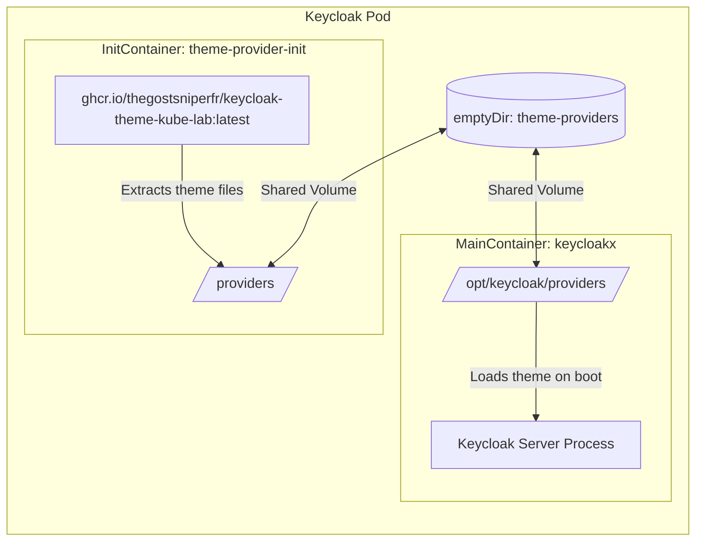
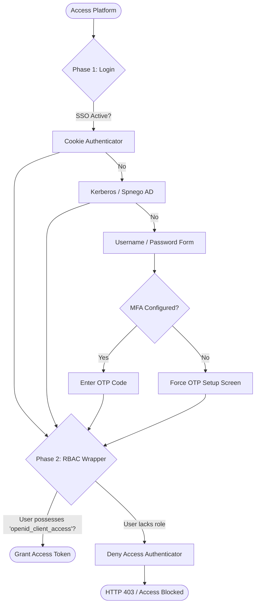

# Identity & Access Management: Keycloak Integration

Keycloak serves as the central Identity Provider (IdP) for the entire CNP ecosystem. It secures the developer portal (CMP), infrastructure platforms (Vault, ArgoCD), and deployed end-user applications via Envoy Gateway edge routing.

---

## 1. Custom Theme Extraction Pipeline (DevOps)

To provide a cohesive brand identity for the portal, CNP implements a customized theme named `keycloak-theme-kube-lab`. 

Instead of baking the theme directly into a heavy, custom Keycloak container image, CNP uses a decoupled, declarative **InitContainer Pipeline** with shared Kubernetes volumes (`emptyDir`).

### Theme Synchronization Architecture:



### Declarative Implementation (`k8s/config/keycloak/values.yaml`):
```yaml
# Shared volume configuration
extraVolumes: |
  - name: theme-providers
    emptyDir: {}

# Mount shared volume to the main Keycloak container
extraVolumeMounts: |
  - name: theme-providers
    mountPath: /opt/keycloak/providers

# InitContainer copy-paste mechanism
extraInitContainers: |
  - name: theme-provider-init
    image: ghcr.io/thegostsniperfr/keycloak-theme-kube-lab:latest
    imagePullPolicy: Always
    volumeMounts:
      - name: theme-providers
        mountPath: /providers
```

On pod startup, the `theme-provider-init` container copies its theme files into `/providers` (the shared volume) and exits. The main Keycloak container then starts, mounts the same volume at `/opt/keycloak/providers`, reads the theme files, and compiles the visual layer.

---

## 2. Browser Authentication Flow (`Browser-3-istor-Login-v4`)

CNP enforces a secure, two-stage authentication and authorization flow. Even if an attacker compromises a user's credentials and passes MFA, Keycloak blocks access at the IdP level if the user lacks the explicit authorization role.



### Flow Configuration Details:

#### Phase 1: Login Wrapper (SSO or Credentials)
1. **Cookie (`auth-cookie`)**: Attempts transparent single sign-on if a browser session is active.
2. **Kerberos (`auth-spnego`)**: Attempts Active Directory SSO handshake.
3. **Forms Fallback (`auth-username-password-form`)**: Prompts for credentials if SSO fails.
4. **Mandatory OTP (`auth-otp-form`)**: Forces users to register and input a TOTP token (using Google Authenticator or similar) upon first login via `keycloak_required_action.totp`.

#### Phase 2: RBAC Deny Wrapper
Once authenticated, Keycloak evaluates the user's role mappings:
* **The Constraint**: The user must possess the `openid_client_access` role.
* **The Action**: If the condition `negate = "true"` (the user does NOT possess the role) is met, Keycloak triggers the `deny-access-authenticator`, blocking token generation.

```hcl
# terraform/auth_flow.tf extract
resource "keycloak_authentication_execution_config" "condition_role_config" {
  realm_id     = keycloak_realm.kube_lab.id
  execution_id = keycloak_authentication_execution.condition_role.id
  alias        = "deny-if-not-3-istor-access"

  config = {
    condUserRole = "openid_client_access"
    negate       = "true" # Triggers downstream deny-access-authenticator if absent
  }
}
```

---

## 3. Project Scopes & Group Mappings

Keycloak maps tenant permissions into OIDC tokens to enforce downstream security boundaries.

### Project Group Convention
When a project is created, the CMP dynamically provisions two Keycloak groups:
* `project-<project_name>-admins`
* `project-<project_name>-members`

### OIDC Scope Mapping (`groups` scope)
To transmit these memberships securely to downstream consumers (ArgoCD, Envoy Gateway, Vault), Keycloak maps group memberships into the JWT token payload.

```hcl
# terraform/scopes.tf extract
resource "keycloak_openid_client_scope" "groups" {
  realm_id               = keycloak_realm.kube_lab.id
  name                   = "groups"
  include_in_token_scope = true
}

resource "keycloak_openid_group_membership_protocol_mapper" "group_mapper" {
  realm_id        = keycloak_realm.kube_lab.id
  client_scope_id = keycloak_openid_client_scope.groups.id
  name            = "group-mapper"
  claim_name      = "groups"
  full_path       = false # Outputs flat "project-alpha-admins" instead of "/project-alpha-admins"
}
```

### Downstream Consumption Matrix:
* **ArgoCD**: Reads the `groups` claim. If it contains `project-alpha-admins`, it grants sync/override permissions inside the matching `project-alpha` ArgoCD `AppProject`.
* **Envoy Gateway**: Reads the `groups` claim at the edge. If the user tries to access `api.alpha.3istor.com` but lacks `project-alpha-members` or `project-alpha-admins`, Envoy blocks the connection.
* **Vault**: Maps the `groups` claim to a Vault identity group alias, granting access to the `kvv2/data/projects/alpha/*` path.

---
**Next Step**: Continue to [ArgoCD GitOps Delivery Specifications](04-gitops-argocd.md) (or return to the [Project Overview](../index.md)).