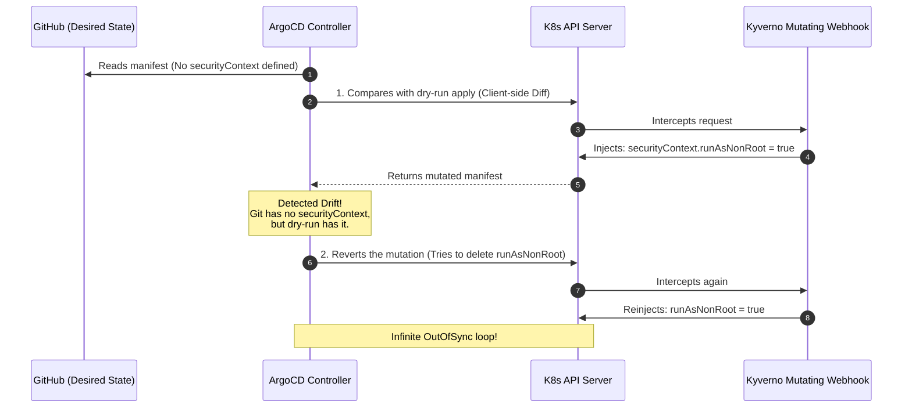

# GitOps Delivery: ArgoCD Configuration

ArgoCD is the core Continuous Delivery (CD) engine of the CNP platform, responsible for reconciling the desired state declared in Git with the live state of the K3s cluster. 

Given CNP's multi-tenant architecture, ArgoCD is configured to enforce strict tenancy barriers using native `AppProject` specifications, OIDC identity sync, and advanced mutation diffing strategies.

---

## 1. Single Sign-On (SSO) & Keycloak RBAC Mappings

ArgoCD delegates authentication to Keycloak. Developers use a single login session across both the CMP and the ArgoCD control panels.

### OIDC Configuration (`argocd-cm`)
ArgoCD is patched to connect directly to the Keycloak `3istor` realm, requesting the custom `groups` scope to extract the user's project affiliations.

```yaml
# k8s/config/argocd/patch-argocd-cm.yaml
apiVersion: v1
kind: ConfigMap
metadata:
  name: argocd-cm
  namespace: argocd
data:
  admin.enabled: "false" # Disables local fallback admin account
  url: "https://argocd.3istor.com"
  oidc.config: |
    name: 3Istor ID
    issuer: https://auth.3istor.com/realms/3istor
    clientID: argocd
    clientSecret: $oidc.keycloak.clientSecret # Synced from Vault
    requestedScopes: ["openid", "profile", "email", "groups"]
```

### Global RBAC Policies (`argocd-rbac-cm`)
To prevent unauthorized cluster access, all actions are blocked by default. Global permissions are assigned based on Keycloak groups:

```yaml
# k8s/config/argocd/patch-argocd-rbac-cm.yaml
data:
  policy.default: "role:denied"
  scopes: "[groups]"
  policy.csv: |
    # Global cluster admins
    g, infra, role:admin
    
    # Global read-only access
    g, member, role:readonly
```

---

## 2. Multi-Tenancy Boundaries (`AppProject`)

CNP isolates teams using ArgoCD's `AppProject` resource. During Day-0 project bootstrapping, the CMP's project-base Helm chart deploys a dedicated `AppProject` matching the tenant.

```yaml
# cnp-project-base/templates/app-project.yaml
apiVersion: argoproj.io/v1alpha1
kind: AppProject
metadata:
  name: {{ .Values.projectName }}
  namespace: argocd
spec:
  description: "Isolated boundaries for project {{ .Values.projectName }}"
  sourceRepos: ["*"]
  
  # Crucial: Restricts this project to namespaces starting with the project prefix
  destinations:
    - namespace: "{{ .Values.projectName }}-*"
      server: "https://kubernetes.default.svc"
      
  # Whitelist standard resources
  namespaceResourceWhitelist:
    - group: "*"
      kind: "*"
      
  # Project-specific roles bound to OIDC groups
  roles:
    - name: "project-admins"
      description: "Admin privileges for {{ .Values.projectName }}"
      policies:
        - "p, proj:{{ .Values.projectName }}:project-admins, applications, *, {{ .Values.projectName }}/*, allow"
      groups: ["project-{{ .Values.projectName }}-admins"]
      
    - name: "project-members"
      description: "Read-only privileges for {{ .Values.projectName }}"
      policies:
        - "p, proj:{{ .Values.projectName }}:project-members, applications, get, {{ .Values.projectName }}/*, allow"
      groups: ["project-{{ .Values.projectName }}-members"]
```

### Security Isolation Rules:
* **Destination Restriction**: Apps within the `alpha` project can *only* be deployed to namespaces starting with `alpha-` (e.g., `alpha-frontend`, `alpha-backend`).
* **RBAC Scoping**: Keycloak group members (`project-alpha-admins`) are mapped only to policies scoped to `proj:alpha:project-admins`, preventing cross-tenant visibility.

---

## 3. Resolving Kyverno Mutating Webhook Loops

The cluster enforces security and resource policies using Kyverno. However, Kyverno's mutating webhooks (which inject default values like security contexts or resource limits if they are missing from Git) can cause infinite reconciliation loops with ArgoCD.

### The Conflict Loop:



### The Resolution (Server-Side Apply & ServerSideDiff)
To break this loop, CNP configures the application runner to calculate diffs and merges **Server-Side** instead of client-side. 

By utilizing **Server-Side Apply**, the Kubernetes API server itself handles the merge resolution and ownership of fields. By utilizing **ServerSideDiff**, ArgoCD queries the API server *after* all mutating webhooks have executed, eliminating fake drift detections.

```yaml
# Injected into the Application CRD by CMP Terraform
apiVersion: argoproj.io/v1alpha1
kind: Application
metadata:
  name: project-alpha-frontend
  namespace: argocd
  annotations:
    # 1. Calculates diff against post-mutation state
    argocd.argoproj.io/compare-options: ServerSideDiff=true,IncludeMutationWebhook=true
spec:
  project: project-alpha
  source:
    repoURL: https://github.com/my-org/project-alpha-frontend.git
    targetRevision: HEAD
    path: .
    helm:
      valueFiles:
        - deploy/values.yaml
  destination:
    server: https://kubernetes.default.svc
    namespace: project-alpha-frontend
  syncPolicy:
    automated:
      prune: true
      selfHeal: true
    syncOptions:
      # 2. Delegates merge responsibility to K8s API server
      - ServerSideApply=true
      - CreateNamespace=true
```

---
**Next Step**: Continue to [Terraform Provisioner & State Management Specs](../04-templates/03-terraform-provisioner.md) (or return to the [Project Overview](../index.md)).