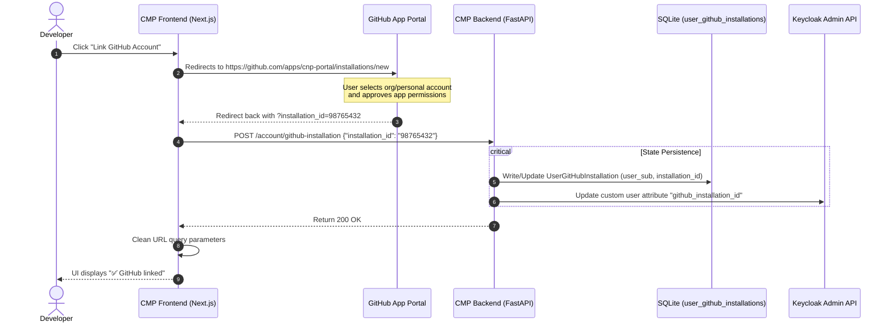

# GitHub Integration: Dedicated GitHub App Model

To enforce the principle of least privilege, CNP completely rejects the use of global Personal Access Tokens (PATs). Instead, it implements a decentralized **GitHub App** integration model using a dedicated App (e.g., `CNP-Portal`, ID: `3836905`) installed on user or organization accounts.

---

## 1. Onboarding & Linking Lifecycle

The onboarding process connects a developer's Keycloak identity to their GitHub organization installation, persisting the state inside both Keycloak user attributes and the CMP SQLite database.



---

## 2. GitHub App Permissions Matrix

The `CNP-Portal` GitHub App is configured with minimal, highly scoped permissions to perform automated repository management and GitOps write-backs:

| Scope | Permission | Purpose |
| :--- | :--- | :--- |
| **Repository: Administration** | `Read & Write` | Creating new repositories on Day-0 and configuring branch protection. |
| **Repository: Contents** | `Read & Write` | Bootstrapping the code template and committing Day-2 config updates. |
| **Repository: Metadata** | `Read-only` | Accessing repository basic structure (Required by GitHub). |
| **Repository: Webhooks** | `Read & Write` | Subscribing to push events to notify CMP of developer updates. |

---

## 3. Token Generation Workflow (Backend Mechanics)

Whenever the SAGA orchestrator or the project bootstrapper needs to interact with GitHub, it generates a short-lived **Installation Access Token** (valid for 60 minutes) dynamically using the App's private key (`GITHUB_APP_PRIVATE_KEY` stored securely in Vault).

### A. Step 1: Generate signed JWT (Expires in 10 minutes)
The backend signs a JWT using the RS256 algorithm with the GitHub App private key:
```python
# app/services/github_service.py extract
def generate_jwt() -> str:
    now = datetime.now(timezone.utc)
    payload = {
        "iat": int(now.timestamp()),
        "exp": int((now + timedelta(minutes=10)).timestamp()),
        "iss": "3836905", # GitHub App ID
    }
    return jwt.encode(payload, settings.GITHUB_APP_PRIVATE_KEY, algorithm="RS256")
```

### B. Step 2: Request Installation Access Token
The JWT is exchanged for a scoped token:
```python
# app/services/github_service.py extract
async def get_installation_token(installation_id: str) -> str:
    app_jwt = generate_jwt()
    url = f"https://api.github.com/app/installations/{installation_id}/access_tokens"
    headers = {
        "Authorization": f"Bearer {app_jwt}",
        "Accept": "application/vnd.github+json",
        "X-GitHub-Api-Version": "2022-11-28",
    }
    async with httpx.AsyncClient() as client:
        response = await client.post(url, headers=headers)
        return response.json()["token"]
```

---

## 4. ArgoCD Private Repository Access

To allow ArgoCD to sync the newly created private repository, Terraform configures ArgoCD with the GitHub App credentials directly using a dedicated K8s Secret. This allows ArgoCD to dynamically rotate its own tokens to pull the code.

```yaml
# Configured via Terraform during Day-0 Bootstrapping
apiVersion: v1
kind: Secret
metadata:
  name: private-repo-creds
  namespace: argocd
  labels:
    argocd.argoproj.io/secret-type: repository
stringData:
  type: git
  url: "https://github.com/my-user-org/my-new-app.git"
  githubAppID: "3836905"
  githubAppInstallationID: "98765432"
  githubAppPrivateKey: | # Injected securely via TF_VAR_github_app_private_key
```

---
**Next Step**: Continue to [App Provisioning Flow](../03-pipelines-and-workflows/01-app-provisioning-flow.md) (or return to the [Project Overview](../index.md)).