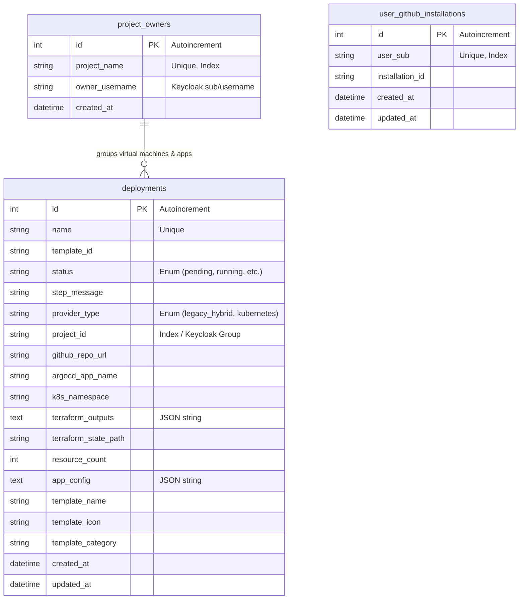
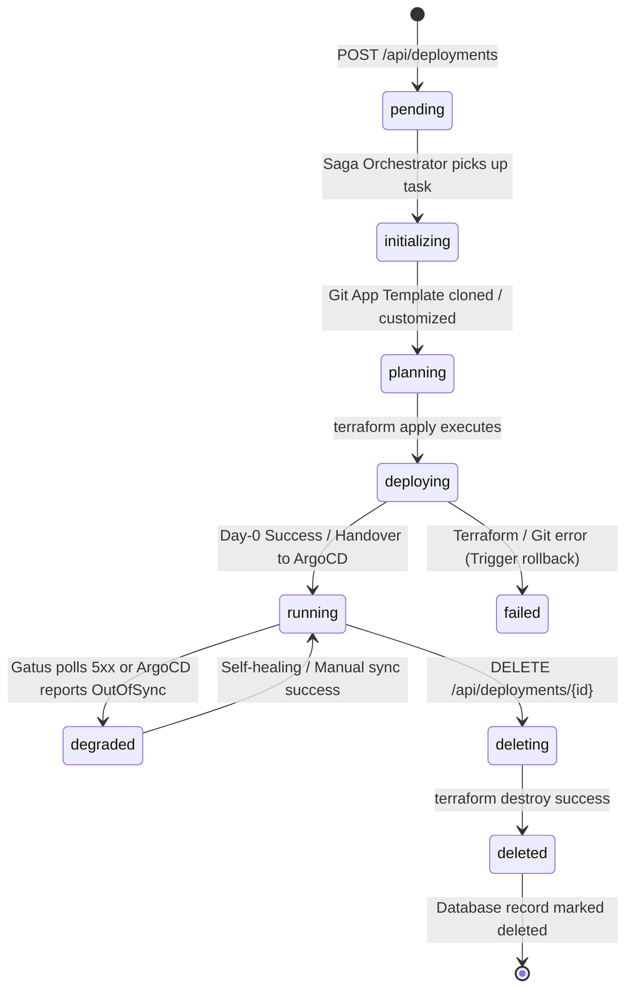

# Database Schema & Data Models

The Cloud Native Platform (CNP) backend uses a relational database model (SQLite for development/light production, PostgreSQL for highly available enterprise setups) managed by SQLAlchemy 2.0 ORM. Schema migrations are tracked incrementally using Alembic.

---

## 1. Entity-Relationship Diagram (ERD)

The database schema isolates deployment states, immutable project creator ownerships, and user-to-GitHub App installations.



---

## 2. Table Schemas & Definitions

### A. `deployments` Table
This is a polymorphic table storing both legacy hybrid configurations (AWS + OpenStack IDs) and K3s GitOps configuration metadata.

| Column | Type | Constraints | Description |
| :--- | :--- | :--- | :--- |
| `id` | Integer | Primary Key | Autoincremented identifier. |
| `name` | String(100) | Unique, Not Null | Unique name generated for the application instance. |
| `template_id` | String(50) | Not Null | ID of the deployed template from the Catalog. |
| `status` | Enum | Not Null | Operational state (e.g., `pending`, `running`, `failed`). |
| `step_message` | String(255) | Not Null | Human-readable progress description or error dump. |
| `provider_type` | Enum | Not Null, Default: `LEGACY_HYBRID` | Discriminator: `LEGACY_HYBRID` or `KUBERNETES`. |
| `project_id` | String(100) | Nullable | References the Keycloak Project Group. |
| `github_repo_url` | String(255) | Nullable | Link to the created private GitOps repository. |
| `argocd_app_name` | String(100) | Nullable | Reconciled Application CRD name in ArgoCD. |
| `k8s_namespace` | String(100) | Nullable | Deployed namespace (`<project_id>-<name>`). |
| `terraform_outputs` | Text | Nullable | JSON string containing parsed Terraform output variables. |
| `terraform_state_path`| String(255) | Nullable | S3 bucket key pointing to the isolated `.tfstate` file. |
| `resource_count` | Integer | Default: 0 | Number of live resources managed by this micro-state. |
| `app_config` | Text | Nullable | Raw JSON parameters supplied by the developer. |

### B. `project_owners` Table
Stores the immutable creator of a project. While standard project membership lives inside Keycloak groups, the creator is mapped here to guarantee permanent ownership rights.

| Column | Type | Constraints | Description |
| :--- | :--- | :--- | :--- |
| `id` | Integer | Primary Key | Autoincremented identifier. |
| `project_name` | String(100) | Unique, Index, Not Null | Unique identifier of the project (lowercase kebab-case). |
| `owner_username` | String(255) | Not Null | Keycloak username of the creator. |
| `created_at` | DateTime | Default: `now()` | Generation timestamp. |

### C. `user_github_installations` Table
Maps the developer's unique Keycloak subject claim (`sub`) to their GitHub App installation identifier. This allows the backend to generate dynamic GitHub access tokens on behalf of the user.

| Column | Type | Constraints | Description |
| :--- | :--- | :--- | :--- |
| `id` | Integer | Primary Key | Autoincremented identifier. |
| `user_sub` | String(255) | Unique, Index, Not Null | Keycloak user UUID (`sub` claim). |
| `installation_id` | String(100) | Not Null | Installation token identifier returned by GitHub. |

---

## 3. Data Ownership & Security Boundaries

CNP enforces split-ownership boundaries. Database tables are segmented between **Global metadata** and **User/Tenant metadata**:

```
                              ┌────────────────────────────────┐
                              │    User Security Context       │
                              │    (Keycloak JWT Groups)       │
                              └───────────────┬────────────────┘
                                              │
                     ┌────────────────────────┴────────────────────────┐
                     ▼                                                 ▼
        ┌─────────────────────────┐                       ┌─────────────────────────┐
        │  User/Tenant Owned      │                       │     Global Metadata     │
        ├─────────────────────────┤                       ├─────────────────────────┤
        │ • user_github_install   │                       │ • deployments table     │
        │ • project_owners        │                       │ • template configurations│
        └─────────────────────────┘                       └─────────────────────────┘
```

* **Tenant Boundary Filtering**: Although the `deployments` table is technically global, the CMP backend filters queries at the API layer. A user can only see or mutate a deployment if their Keycloak JWT contains the `project-<project_id>-admins` or `project-<project_id>-members` group claim corresponding to the deployment's `project_id`.

---

## 4. Entity State Machine Lifecycles

### A. Application Deployment Lifecycle (K8s / GitOps)

The state machine transitions sequentially. If a step fails during Day-0, the state is forced into `failed` and SAGA compensations are executed.



---

## 5. Database Initializations & Migrations

### A. SQLite Concurrency: Write-Ahead Logging (WAL)
Because the CMP Backend executes heavy background tasks (like shell processes running Terraform), SQLite can easily experience database locks. To prevent queries from freezing, the platform explicitly configures SQLite connection pools to use **WAL Mode**:

```python
# app/core/database.py
@event.listens_for(engine, "connect")
def set_sqlite_pragma(dbapi_connection, connection_record):
    cursor = dbapi_connection.cursor()
    cursor.execute("PRAGMA journal_mode=WAL;")
    cursor.execute("PRAGMA synchronous=NORMAL;")
    cursor.close()
```

### B. Alembic Migrations
Migrations are managed incrementally. For example, to migrate the schema from Phase 2 to Phase 3 (adding multi-provider columns), Alembic executes the following operations:

```python
# alembic/versions/c4d8f2a91b3e_add_kubernetes_provider_support.py
def upgrade() -> None:
    op.add_column('deployments', sa.Column('provider_type', sa.Enum('LEGACY_HYBRID', 'KUBERNETES', name='providertype'), nullable=False, server_default='LEGACY_HYBRID'))
    op.add_column('deployments', sa.Column('project_id', sa.String(100), nullable=True))
    op.add_column('deployments', sa.Column('github_repo_url', sa.String(255), nullable=True))
    op.add_column('deployments', sa.Column('argocd_app_name', sa.String(100), nullable=True))
    op.add_column('deployments', sa.Column('k8s_namespace', sa.String(100), nullable=True))
```

---
**Next Step**: Continue to [Frontend Architecture Specification](07-frontend-architecture.md) (or return to the [Project Overview](../index.md)).
