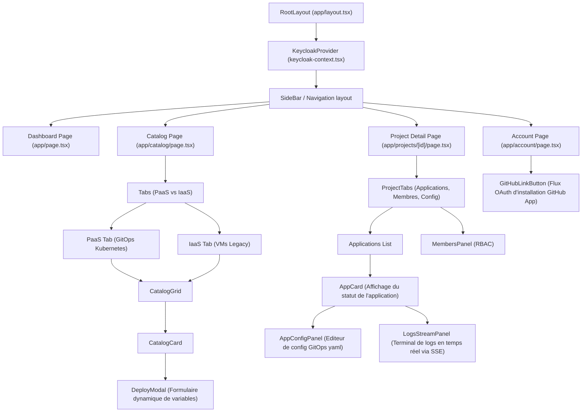

# Architecture Frontend : Portail CMP (Next.js) ⚡

Ce document décrit l'architecture technique du Frontend de la **Cloud Management Platform (CMP)**, développée en Next.js (React). Il détaille la structure des répertoires, l'arborescence des composants, le cycle de vie de la session utilisateur OIDC (Keycloak JWT) et les mécanismes de mise à jour de l'état en temps réel.

Pour des informations complémentaires, consultez :
* L'architecture globale du portail : [01-cmp-dashboard.md](file:///home/brian/Documents/aepita/ing2/3-Istor/cnp-docs/02-core-components/01-cmp-dashboard.md)
* L'intégration avec Keycloak : [02-identity-keycloak.md](file:///home/brian/Documents/aepita/ing2/3-Istor/cnp-docs/02-core-components/02-identity-keycloak.md)
* Le guide d'intégration API Phase 4 : [03-cmp-frontend-integration.md](file:///home/brian/Documents/aepita/ing2/3-Istor/cnp-docs/05-cmp-backend-api/03-cmp-frontend-integration.md)
* Le contrat d'API de déploiement : [01-cmp-deployment-api.md](file:///home/brian/Documents/aepita/ing2/3-Istor/cnp-docs/05-cmp-backend-api/01-cmp-deployment-api.md)

---

## 📂 Structure du Répertoire Frontend

L'application utilise le **Next.js App Router** avec l'arborescence `src/app/` pour définir les routes et gérer le rendu (côté serveur et côté client).

```text
frontend/src/
├── app/                         # Dossier racine du Next.js App Router
│   ├── layout.tsx               # Layout principal (Nav, Providers d'authentification)
│   ├── page.tsx                 # Page d'accueil / Tableau de bord global
│   ├── auth/
│   │   └── callback/            # Point de retour OIDC (Keycloak Login Callback)
│   ├── catalog/
│   │   └── page.tsx             # Catalogue de templates (Dual Tabs : PaaS vs IaaS)
│   ├── projects/
│   │   └── [id]/                # Détail d'un projet (Applications, configuration GitOps, Membres)
│   └── account/
│       └── page.tsx             # Gestion de compte, liaison GitHub
├── components/                  # Composants UI React réutilisables
│   ├── account/                 # GitHubLinkButton (Bouton OAuth)
│   ├── catalog/                 # CatalogGrid, DeployModal (Formulaires)
│   ├── dashboard/               # Widgets de statistiques et statuts globaux
│   ├── projects/                # AppCard, AppConfigPanel (Editeur yaml), MembersPanel
│   └── ui/                      # Composants génériques bas niveau (boutons, inputs, etc.)
├── lib/                         # Logique utilitaire et clients API
│   ├── api-client.ts            # Client HTTP configuré avec injecteur JWT
│   └── keycloak-context.tsx     # Contexte React d'authentification (session client)
└── types/                       # Interfaces TypeScript partagées (Deployment, Project)
```

---

## 🗺️ Arborescence des Composants UI

Le schéma suivant montre comment les layouts, providers et composants de pages s'agencent :



---

## 🔑 Gestion de la Session Utilisateur (JWT Keycloak)

L'authentification s'appuie sur le protocole **OpenID Connect (OIDC)** géré par Keycloak.

### 1. Cinématique d'Authentification (Authorization Code Flow)
1. **Redirection vers l'IdP** : Si l'utilisateur n'est pas connecté, le composant `KeycloakProvider` intercepte la route et redirige le navigateur vers Keycloak (`/auth/realms/kube-lab/protocol/openid-connect/auth`).
2. **Retour de code d'autorisation** : Après authentification et validation MFA, Keycloak redirige l'utilisateur vers `/auth/callback?code=CODE`.
3. **Échange et récupération du JWT** : La page de callback capture le code temporaire et appelle le endpoint `/token` de Keycloak pour obtenir trois jetons :
   * `access_token` (JWT à courte durée de vie, par exemple 15 minutes).
   * `refresh_token` (Jeton persistant pour renouveler l'accès).
   * `id_token` (Informations sur l'identité de l'utilisateur).

### 2. Stockage et Sécurité du Jeton
Pour limiter les risques de failles de sécurité **XSS (Cross-Site Scripting)**, le client applique les règles suivantes :
* L'`access_token` est conservé uniquement **en mémoire** dans le contexte React (`KeycloakContext`). Il n'est jamais écrit dans le `localStorage` ou le `sessionStorage`.
* Le `refresh_token` est géré de manière sécurisée par l'intégration `keycloak-js` (via des cookies ou un stockage de session isolé) permettant le renouvellement transparent du jeton d'accès en arrière-plan sans perturber l'expérience utilisateur.

### 3. Interception et Injection API
Pour communiquer avec le Backend FastAPI du CMP, toutes les requêtes HTTP passent par un client d'API personnalisé ([api-client.ts](file:///home/brian/Documents/aepita/ing2/3-Istor/cnp-docs/frontend/src/lib/api-client.ts)). Cet outil intercepte l'envoi et injecte dynamiquement l'en-tête d'authentification :

```typescript
// Extrait conceptuel de lib/api-client.ts
async function fetchWithAuth(url: string, options: RequestInit = {}) {
  // Récupère le token valide depuis le contexte en mémoire
  const token = await getValidToken(); 
  
  const headers = {
    ...options.headers,
    'Authorization': `Bearer ${token}`,
    'Content-Type': 'application/json',
  };

  return fetch(url, { ...options, headers });
}
```

---

## 📡 Rafraîchissement et Streaming de l'État Global

Le suivi des statuts de déploiements (`PENDING` ➔ `PROVISIONING` ➔ `RUNNING`) et l'affichage des journaux d'exécution Terraform nécessitent des stratégies différentes pour minimiser la consommation réseau tout en garantissant une réactivité immédiate.

### 1. Streaming des Logs en Temps Réel (Server-Sent Events)
Lors du bootstrapping initial (Day-0) d'une application ou d'un rollback SAGA, le runner Terraform écrit continuellement des logs de sortie. Le Frontend CMP utilise les **Server-Sent Events (SSE)** (technologie W3C native) pour streamer ce flux de logs sans l'overhead des WebSockets.

* **Mécanique technique** :
  1. Le Frontend initie une connexion persistante via la classe JavaScript `EventSource`.
  2. Le backend FastAPI envoie des trames de données de type `text/event-stream`.
  3. L'application met à jour le composant `LogsStreamPanel` au fil de l'eau.

* **Exemple d'implémentation client** :
```typescript
// components/projects/LogsStreamPanel.tsx
import { useEffect, useState } from "react";

export function LogsStreamPanel({ deploymentId }: { deploymentId: number }) {
  const [logs, setLogs] = useState<string[]>([]);

  useEffect(() => {
    // Les requêtes SSE standards du navigateur ne supportent pas nativement
    // l'envoi d'en-têtes personnalisés (Authorization: Bearer).
    // CNP passe donc le token de session via un paramètre de requête HTTP :
    const token = getCachedToken();
    const eventSource = new EventSource(`/api/deployments/${deploymentId}/logs/stream?token=${token}`);

    eventSource.onmessage = (event) => {
      // Ajout de la ligne de log reçue dans le terminal virtuel
      setLogs((prevLogs) => [...prevLogs, event.data]);
    };

    eventSource.onerror = (error) => {
      console.error("Erreur de flux SSE :", error);
      eventSource.close();
    };

    return () => {
      eventSource.close(); // Ferme la socket lorsque le composant est démonté
    };
  }, [deploymentId]);

  return (
    <pre className="bg-black text-green-400 p-4 rounded overflow-y-auto max-h-96">
      {logs.map((log, idx) => <div key={idx}>{log}</div>)}
    </pre>
  );
}
```

### 2. Rafraîchissement des Métadonnées & Statuts (Polling)
Pour les informations moins denses mais nécessitant une cohérence temporelle (comme le statut général d'un déploiement ou l'état de synchronisation d'ArgoCD), le Frontend utilise le concept de **Short Polling** contrôlé par **React Query / SWR**.

* **Fonctionnement** :
  * Si l'application affiche un statut transitionnel (`PENDING` ou `PROVISIONING`), React Query configure une fréquence de rafraîchissement élevée (`refetchInterval: 5000` soit toutes les 5 secondes).
  * Dès que le statut passe à un état stable (`RUNNING`, `DEGRADED`, ou `FAILED`), le rafraîchissement automatique est désactivé (`refetchInterval: false`) pour économiser les ressources de la base de données et du serveur.

```typescript
// lib/hooks/useDeployment.ts
import { useQuery } from "@tanstack/react-query";

export function useDeployment(id: number) {
  return useQuery({
    queryKey: ["deployment", id],
    queryFn: () => fetchWithAuth(`/api/deployments/${id}`).then(res => res.json()),
    // Désactive le polling si le déploiement n'est plus en cours de modification
    refetchInterval: (query) => {
      const status = query.state.data?.status;
      return (status === "PENDING" || status === "PROVISIONING") ? 5000 : false;
    }
  });
}
```

---
**Next Step**: Continue to [App Provisioning Flow](../03-pipelines-and-workflows/01-app-provisioning-flow.md) (or return to the [Project Overview](../index.md)).
