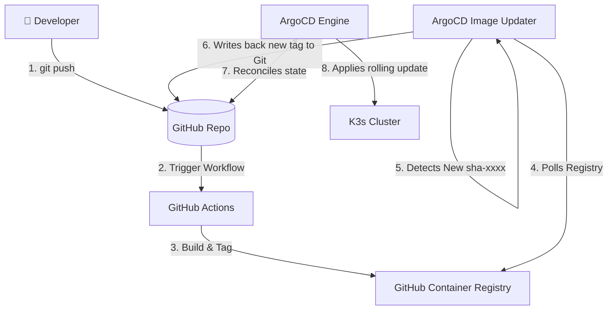

# Continuous Integration & Delivery (CI/CD)

CNP provides a seamless "code-to-cluster" automated pipeline. Developers only need to write application code and push to GitHub. The platform handles testing, building, and delivering the workloads to the K3s cluster automatically.

---

## 1. CI/CD Architecture Overview

The pipeline integrates three decoupled components to enforce Git as the Single Source of Truth (SSOT) while eliminating complex pipeline scripts or manual token configurations:



---

## 2. Continuous Integration (GitHub Actions)

When the CMP provisions a new application from a Git App Template, it automatically commits a standardized, highly optimized `.github/workflows/ci.yml` file into the repository.

### Standard CI Pipeline Spec (`ci.yml`):
```yaml
name: CI/CD Pipeline

on:
  push:
    branches: [main]
  pull_request:
    branches: [main]

env:
  REGISTRY: ghcr.io
  IMAGE_NAME: ${{ github.repository }}

jobs:
  test:
    name: Test & Lint
    runs-on: ubuntu-latest
    steps:
      - uses: actions/checkout@v4

      - name: Setup Node.js
        uses: actions/setup-node@v4
        with:
          node-version: '20'
          cache: 'npm'

      - name: Install dependencies
        run: npm ci

      - name: Run linter
        run: npm run lint || echo "No lint script found"

      - name: Run tests
        run: npm test || echo "No test script found"

  build:
    name: Build & Push Image
    runs-on: ubuntu-latest
    needs: test
    if: github.event_name == 'push' && github.ref == 'refs/heads/main'

    permissions:
      contents: read
      packages: write

    steps:
      - uses: actions/checkout@v4

      - name: Log in to GitHub Container Registry
        uses: docker/login-action@v3
        with:
          registry: ${{ env.REGISTRY }}
          username: ${{ github.actor }}
          # Authenticates dynamically using the native repository token
          password: ${{ secrets.GITHUB_TOKEN }}

      - name: Extract metadata (tags, labels)
        id: meta
        uses: docker/metadata-action@v5
        with:
          images: ${{ env.REGISTRY }}/${{ env.IMAGE_NAME }}
          tags: |
            type=sha,prefix=sha-,format=short
            type=raw,value=latest

      - name: Build and push Docker image
        uses: docker/build-push-action@v5
        with:
          context: .
          push: true
          tags: ${{ steps.meta.outputs.tags }}
          labels: ${{ steps.meta.outputs.labels }}
          # Optimized caching utilizing inline and registry layers
          cache-from: type=registry,ref=${{ env.REGISTRY }}/${{ env.IMAGE_NAME }}:latest
          cache-to: type=inline
```

### Security & Performance Controls:
* **Zero Secret Exposure**: No manual Docker or GitHub credentials are ever stored in the repository. The workflow uses the temporary `${{ secrets.GITHUB_TOKEN }}` granted by the runner.
* **Tagging Strategy**: Every production build is tagged with `latest` and `sha-[short-hash]` (e.g., `sha-8f3a1b4`). This specific tag format is required for continuous delivery.
* **Inline Caching**: Leveraging `cache-from` and `cache-to` ensures that Docker layers (such as Node modules) are reused across builds, cutting build times down.

---

## 3. Continuous Delivery (ArgoCD Image Updater)

To achieve true GitOps, the cluster must be updated when a new container image is pushed to the registry. Traditionally, this requires the CI pipeline to have write-access to the repository to commit the new image tag. 

CNP eliminates this push-back pattern by running the **ArgoCD Image Updater** inside the cluster.

### Image Updater Specification:
Alongside the main application, Terraform deploys an `ImageUpdater` custom resource. It polls the GHCR registry, detects new tags matching the commit SHA pattern, and commits the tag back to Git.

```yaml
apiVersion: argocd-image-updater.argoproj.io/v1alpha1
kind: ImageUpdater
metadata:
  name: alpha-frontend-updater
  namespace: argocd
spec:
  applicationRefs:
    - namePattern: "alpha-frontend"

      images:
        - alias: "app-image"
          imageName: "ghcr.io/3-istor/frontend"
          # Injects the pull secret created during Day-0
          pullSecret: "secret:alpha-frontend/app-registry"

          manifestTargets:
            helm:
              name: "image.repository"
              tag: "image.tag"

          commonUpdateSettings:
            updateStrategy: "newest-build"
            allowTags: "regexp:^sha-[a-f0-9]+$"

      writeBackConfig:
        # Uses the GitHub App credentials secret to write back to Git
        method: "git:secret:argocd/private-repo-creds"
        gitConfig:
          branch: "main"
          writeBackTarget: "helmvalues:/deploy/values.yaml"
```

### The Write-Back Mechanism
1. **Detection**: Every 2 minutes, the Image Updater polls `ghcr.io/3-istor/frontend`.
2. **Tag Matching**: It ignores `latest` (which is mutable and bad for audits) and locates the newest tag matching `sha-[a-f0-9]+`.
3. **Commit to Git**: It uses the GitHub App credentials stored in the `private-repo-creds` secret to push a commit directly to the repository's `main` branch.
4. **ArgoCD Sync**: ArgoCD detects the new commit in Git, notices the change in `image.tag` inside `values.yaml`, and applies a rolling update to the deployment workloads in the cluster.

---
**Next Step**: Continue to [Developer Configuration & GitOps Flow](03-developer-configuration-flow.md) (or return to the [Project Overview](../index.md)).