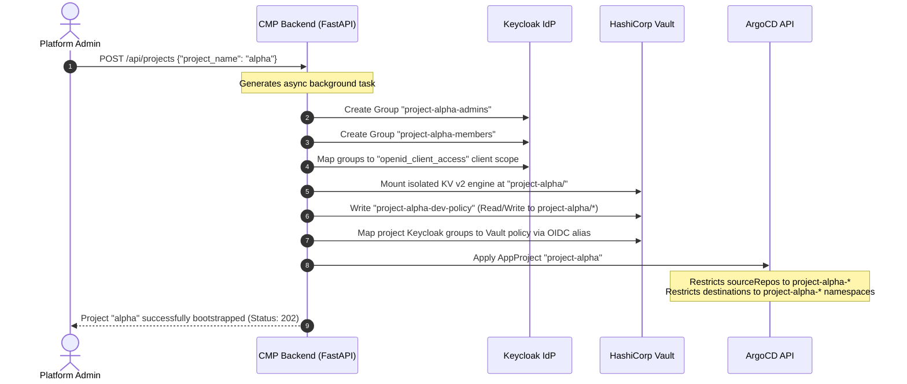
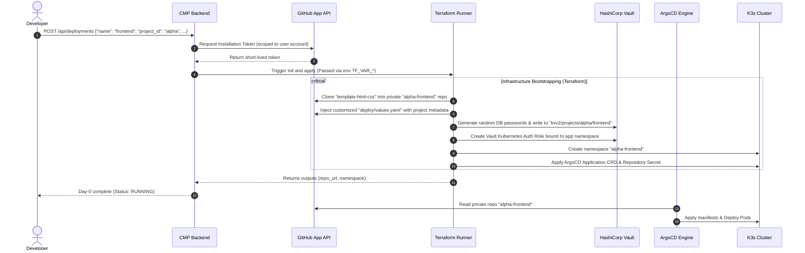
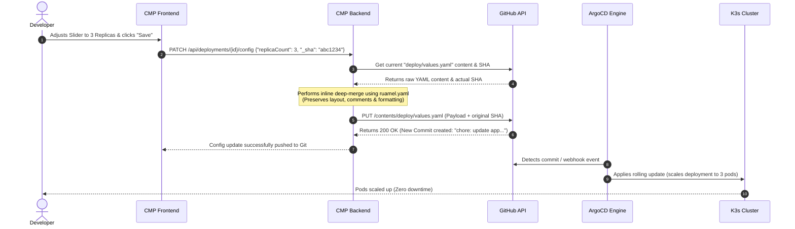
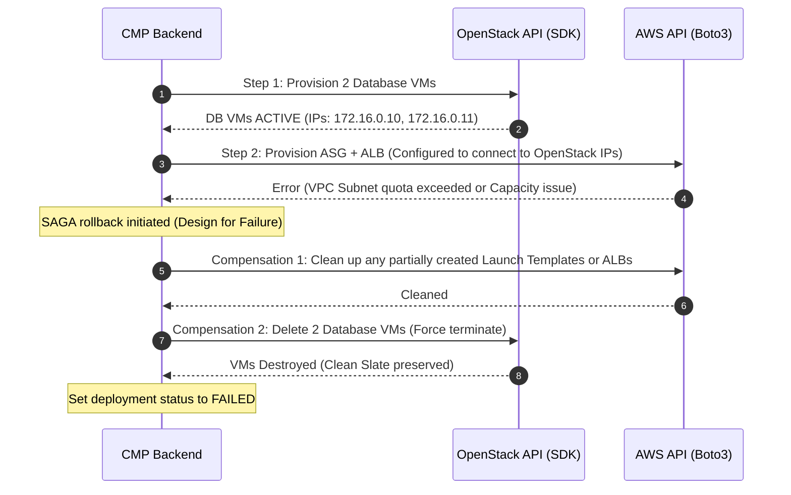

# Platform Process & System Flows

This document details the exact sequence of events, transactional steps, and integrations across the Control, Provisioning, and Delivery planes for the core workflows of the Cloud Native Platform (CNP).

---

## 1. Flow 1: Day-0 Project Bootstrapping

This flow is executed when an administrator creates a new Project (Team security boundary) in the CMP.

### Detailed Sequence
1. **Request Validation**: The administrator submits a project creation request. The API validates the name against strict kebab-case constraints.
2. **Keycloak Group Provisioning**: The backend calls the Keycloak Admin API to create administrative and member groups. These groups are bound to OIDC scopes so downstream applications can read membership details from OIDC tokens.
3. **Vault Isolation**: A dedicated, isolated KV engine is mounted at `project-alpha/`. An access policy is written and bound to Keycloak group names using Vault’s external OIDC identity aliases.
4. **ArgoCD Sandboxing**: An `AppProject` CRD is deployed to ArgoCD, establishing a secure sandbox that prevents the project from deploying manifests outside its designated namespaces.

---

## 2. Flow 2: Day-0 Application Provisioning (GitOps Handover)

This flow is executed when a developer deploys a new K8s application template (e.g., `template-html-css`) inside an existing project.

### Detailed Sequence
1. **Dynamic Token Generation**: The CMP Backend signs a JWT with the GitHub App's private key, requests a 1-hour installation token from GitHub, and injects it into the Terraform runner environment variables.
2. **Repository Isolation**: Terraform clones the template repository to form the new application repository and configures main branch protection.
3. **Values.yaml Customization**: A customized `deploy/values.yaml` is generated on the fly (with database paths and ingress endpoints) and committed to the repository.
4. **Vault & Kubernetes Alignment**: Terraform writes randomly generated credentials to the application's Vault path and creates a `vault_kubernetes_auth_backend_role` bound to the application's unique K8s ServiceAccount.
5. **ArgoCD Takeover**: Terraform creates the ArgoCD `Application` CRD. ArgoCD picks up the manifest, clones the repository, renders the generic Helm chart, and deploys the pods.

---

## 3. Flow 3: Day-2 Configuration Update (GitOps Write-Back)

This flow is executed when a developer adjusts resource counts or toggles SSO protection directly from the CMP UI.

### Detailed Sequence
1. **Conflict Protection**: The frontend fetches the current config SHA using `GET /config` and includes it in the `PATCH` payload to prevent concurrent write collisions (HTTP 409).
2. **Deep-Merging**: The backend fetches the raw YAML from GitHub. It parses the structure with `ruamel.yaml` (preserving whitespace and comments), deep-merges the changed parameters, and serializes it back to a string.
3. **Automated Commit**: The backend sends a PUT request to the GitHub API, creating a descriptive commit (e.g., `chore: update app configuration via CMP`).
4. **Reconciliation**: ArgoCD detects the change in Git and triggers a rolling update in the cluster to scale the deployment.

---

## 4. Flow 4: Legacy Hybrid SAGA Rollback

This flow is executed during a multi-provider deployment (OpenStack VMs + AWS Auto Scaling Group) if the AWS step fails.

### Detailed Sequence
1. **Stateful Step**: The SAGA orchestrator provisions the database layer on OpenStack. It waits until the VMs are `ACTIVE` and extracts their fixed IPs.
2. **Stateless Step**: The orchestrator attempts to deploy the AWS Auto Scaling Group and ALB, passing the OpenStack IPs to the user-data.
3. **Failure Isolation**: If AWS returns a resource limits error, the orchestrator intercepts the failure and prevents partial orphans.
4. **Compensating Actions**: The SAGA manager executes the rollback pipeline sequentially, cleaning up partial AWS assets and force-deleting the OpenStack database VMs, restoring the system to a clean state.

---
**Next Step**: Continue to [Platform Testing Strategy](05-testing-strategy.md) (or return to the [Project Overview](../index.md)).
