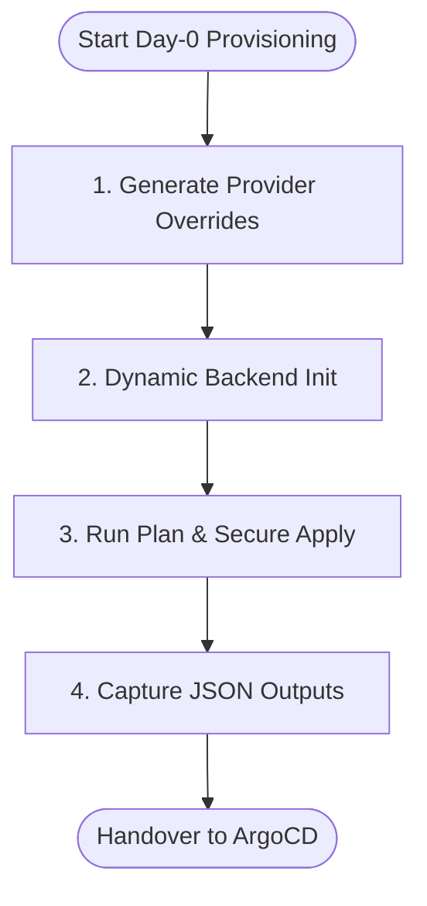
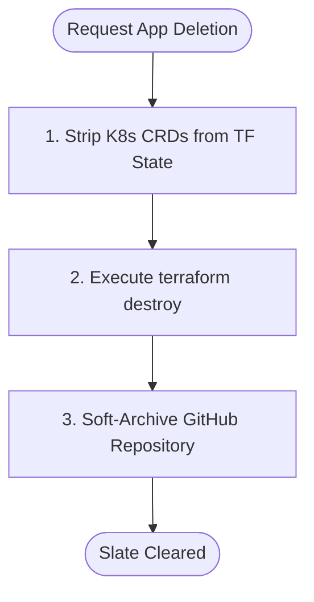

# Terraform Provisioner & State Management

The Terraform App Provisioner is the automation engine utilized by the CMP Backend during the **Day-0 (Bootstrapping)** phase of an application. It prepares external APIs and local cluster environments before ArgoCD takes over the continuous delivery cycle.

---

## 1. The Micro-State Pattern (S3 State Isolation)

To prevent risk, latency, and state-locking conflicts associated with a single monolithic state file, CNP implements a **Micro-State Pattern**. Every application deployment and project bootstrap managed by the CMP receives its own isolated `.tfstate` file stored in AWS S3.

### S3 State Directory Structure:
```text
3-istor-tf-infra-aws (S3 Bucket)
├── infra/
│   └── k3s-master/
│       └── terraform.tfstate             # Static Base Infrastructure State
└── cmp/
    └── projects/
        └── project-alpha/
            ├── bootstrap.tfstate         # Isolated Project Bootstrap State
            ├── app-frontend.tfstate      # Isolated Frontend App State
            └── app-backend.tfstate       # Isolated Backend App State
```

### Dynamic Backend Initialization
When the CMP Backend triggers a deployment, it does not use a hardcoded state key. Instead, the `TerraformExecutor` configures the S3 backend dynamically during `terraform init` using command-line `-backend-config` flags.

```python
# app/services/terraform_executor.py extract
def _get_backend_config(self) -> list[str]:
    if not self.use_s3_backend or not settings.TF_BACKEND_S3_BUCKET:
        return []

    # Dynamic path mapping: cmp/projects/{project_id}/{app_name}
    s3_key = f"cmp/projects/{self.project_id}/{self.deployment_name}.tfstate"

    return [
        f"-backend-config=bucket={settings.TF_BACKEND_S3_BUCKET}",
        f"-backend-config=key={s3_key}",
        f"-backend-config=region={settings.TF_BACKEND_AWS_REGION}",
        "-backend-config=encrypt=true",
        f"-backend-config=dynamodb_table={settings.TF_BACKEND_S3_DYNAMODB_TABLE}" # Prevents concurrent applies
    ]
```

---

## 2. Provisioner Responsibilities & Step Execution (Day-0)

When `terraform apply` is executed with the dynamic S3 state, the provisioner executes resources sequentially across four major planes:



### Step 1: Provider Overrides Generation
The template files in the repository contain generic provider bindings. To prevent localhost routing loops inside containers, the `TerraformExecutor` generates a `cmp_override.tf` file on the fly before initialization. This dynamically routes OpenStack and Kubernetes APIs to the real cluster endpoints.

```hcl
# Generated cmp_override.tf example
terraform {
  required_providers {
    openstack = {
      source = "terraform-provider-openstack/openstack"
    }
  }
}
provider "openstack" {
  auth_url = "http://192.168.1.210:5000/v3"
  # Credentials extracted from env settings...
}
```

### Step 2: Secure Secret Injection
CNP enforces a strict zero-leakage security policy. Sensitive parameters (Vault tokens, Keycloak admin passwords, GitHub keys) are **never** passed as command-line `-var` flags (which would expose them in the system's process list). Instead, they are injected directly into the subprocess environment using `TF_VAR_*` variables.

```python
# app/services/terraform_executor.py extract
env = os.environ.copy()
# Injected via environment, hidden from 'ps aux'
env["TF_VAR_vault_token"] = settings.VAULT_TOKEN
env["TF_VAR_keycloak_admin_password"] = settings.KEYCLOAK_ADMIN_PASSWORD
env["TF_VAR_github_app_private_key"] = settings.GITHUB_APP_PRIVATE_KEY
```

### Step 3: Resource Provisioning (Terraform Apply)
During the `terraform apply` phase, the `github_bootstrap` module executes the following resources:
* **`github_repository.app`**: Provisions a private repository under the user's organization.
* **`github_repository_file.values_yaml`**: Generates and pushes the initial `deploy/values.yaml` containing the customized environment overrides.
* **`vault_generic_secret.app_secrets`**: Generates high-entropy passwords (32 characters) and stores them in Vault under `kvv2/data/projects/{project_name}/{app_name}`.
* **`vault_kubernetes_auth_backend_role.app`**: Binds the application service account in the new namespace to the Vault access policy.
* **`kubernetes_namespace.app`**: Provisions the isolated namespace with standard security labels (`pod-security.kubernetes.io/enforce: restricted`).
* **`kubernetes_manifest.argocd_app`**: Deploys the ArgoCD `Application` CRD.

---

## 3. Day-2 Deletion & SAGA Rollback

When a developer deletes an application, or when the SAGA pattern triggers a rollback, resources must be destroyed cleanly.

### The CRD API Validation Bypass
When deleting an application, if the target K3s cluster has already lost its custom resource definitions (CRDs), `terraform destroy` will fail because the Terraform Kubernetes provider cannot validate the schemas of resources like `ArgoCD Application` or `VaultSecret`.

To bypass this and guarantee a clean deletion, the platform's destruction pipeline uses a **three-step cleanup strategy**:



#### 1. Strip Custom Resources from State
The orchestrator programmatically removes the CRDs from the state before running destroy, preventing validation errors from blocking the execution:
```bash
# Automated cleanup snippet
terraform state rm kubernetes_manifest.argocd_app
```

#### 2. Run Destroy with Safety Overrides
Terraform destroys the remaining native resources (namespaces, Keycloak clients, Vault engines).

#### 3. Soft-Archive Repositories
To prevent accidental loss of code history, the GitHub App API does not permanently delete the repository on the user's account; it modifies the repository metadata to set `"archived": true`, putting the code into a **read-only** state.

---
**Next Step**: Continue to [Global API Standards & Authorization](../05-cmp-backend-api/00-global-api-standards.md) (or return to the [Project Overview](../index.md)).