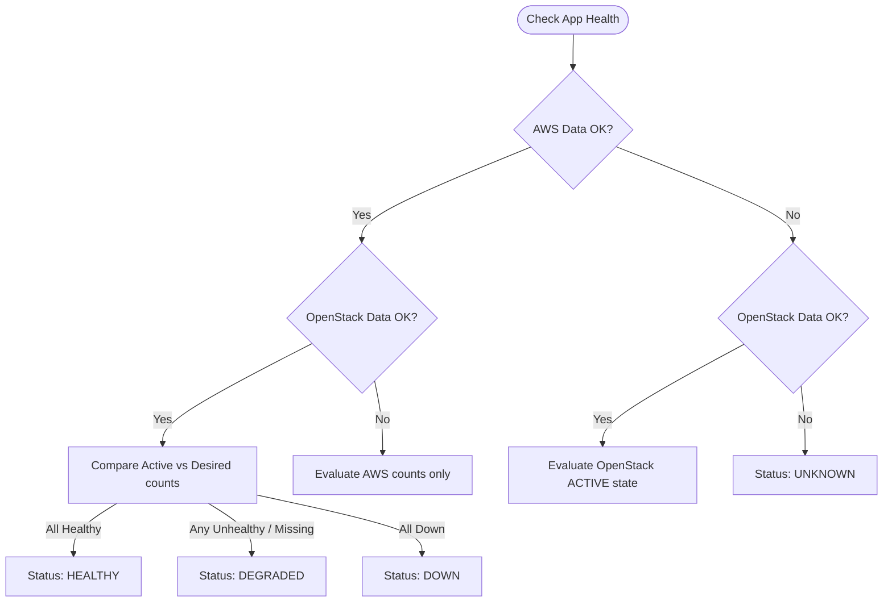

# Infrastructure & Health API Contract

The Infrastructure API exposes real-time, consolidated health metrics gathered via direct cloud provider SDK queries (Boto3 and OpenStackSDK), bypassing potentially stale state tracking systems.

---

## 1. Global Infrastructure Health

Pulls the live network and compute state of the physical bare-metal nodes and secure hybrid tunnels.

* **HTTP Method**: `GET`
* **Path**: `/api/infra/health`
* **Query Parameters**: None.
* **Polling Cadence**: 15 seconds (Recommended for CMP Frontend).
* **Response (`200 OK`)**:

```json
{
  "openstack_vpn": {
    "name": "vpn-gateway",
    "status": "active",
    "ip": "192.168.1.15"
  },
  "aws_vpns": [
    {
      "name": "i-0994d931cee176e7d",
      "status": "running",
      "ip": "10.1.0.5"
    }
  ],
  "openstack_hypervisors": [
    {
      "name": "pae-node-1",
      "state": "up",
      "status": "enabled",
      "ip": "192.168.1.110"
    },
    {
      "name": "pae-node-2",
      "state": "up",
      "status": "enabled",
      "ip": "192.168.1.81"
    }
  ]
}
```

---

## 2. Application Deployment Health

Performs targeted, deep-probing lookups for a specific deployment's logical instances (AWS frontend instances + OpenStack DB servers).

* **HTTP Method**: `GET`
* **Path**: `/api/infra/deployments/{id}/health`
* **Response (`200 OK`)**:

```json
{
  "deployment_name": "frontend-alpha",
  "status": "healthy",
  "aws_frontend": {
    "asg_name": "frontend-alpha-asg",
    "desired_capacity": 2,
    "instances": [
      {
        "instance_id": "i-0a15d55736fd476da",
        "private_ip": "10.1.20.44",
        "state": "running",
        "health": "healthy"
      },
      {
        "instance_id": "i-0694d931cee176e7b",
        "private_ip": "10.1.20.45",
        "state": "running",
        "health": "healthy"
      }
    ],
    "healthy_count": 2,
    "total_count": 2
  },
  "openstack_backend": {
    "servers": [
      {
        "instance_id": "8ca5e72a-8d85-460d-5a3f-a69b8745237f",
        "private_ip": "172.16.0.45",
        "state": "active",
        "health": "healthy"
      }
    ],
    "healthy_count": 1,
    "total_count": 1
  }
}
```

---

## 🛡️ Live Health State Aggregation Logic

The backend consolidates separate AWS and OpenStack payloads using a strict evaluation algorithm:



### State Mapping Logic
* **`healthy`**: Every physical and virtual node is reported in an `ACTIVE` or `running` state AND target health groups report `healthy`.
* **`degraded`**: At least one node is down, OR the AWS Auto Scaling Group's actual instance count is below its `desired_capacity` (e.g., during self-healing or startup scaling).
* **`down`**: All nodes across both environments fail to respond or show terminal failure states.
* **`unknown`**: Downstream cloud provider API queries return 401/403 errors, or no physical VMs matching the namespace can be located.

---
**Next Step**: Continue to [Account & GitHub Link API Contracts](07-cmp-account-api.md) (or return to the [Project Overview](../index.md)).
