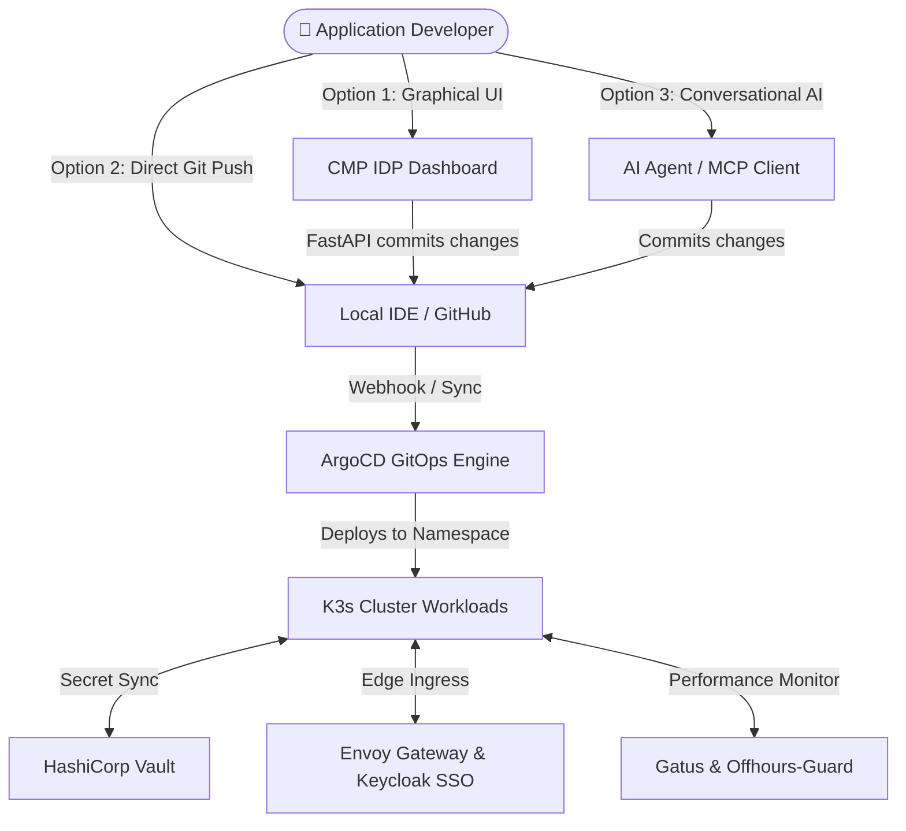

# CNP Developer Playbook & User Guide

Welcome to the **Cloud Native Platform (CNP)**! This guide is designed for application developers, QA engineers, and product collaborators who use CNP to deploy, manage, and monitor containerized workloads. 

This guide details the different pathways to manage your applications and maps out how you interact with each component of our ecosystem.

---

## 🗺️ The Application Developer Journey

As an application developer, you have **three distinct interfaces** to interact with the platform. Each interface converges on Git as the Single Source of Truth (SSOT).



---

## 🚀 Pathway 1: The Internal Developer Portal (CMP UI)

The CMP graphical interface is the recommended entry point for Day-0 provisioning and high-level Day-2 operations.

### Step 1: Authenticate via Keycloak SSO
Navigate to the [CMP Dashboard](https://cmp.3istor.com) and log in using your Keycloak credentials.
> [!NOTE]  
> If this is your first login, the platform will prompt you with a mandatory QR Code configuration screen. You must register this in your authenticator app (Google Authenticator, Bitwarden, etc.) to set up Multi-Factor Authentication (MFA).

### Step 2: Link Your GitHub Account
Before you can deploy templates, you must link your GitHub profile so the platform can create repositories on your behalf:
1. Go to your **Account Page**.
2. Under the **GitHub Integration** card, click **Link GitHub Account**.
3. Select the target user account or organization, authorize the **CNP-Portal** app, and complete the installation.
4. The system will automatically capture your `installation_id` and save it to your profile.

### Step 3: Deploy from the Catalog
1. Go to the homepage and select the **Kubernetes & GitOps** catalog tab.
2. Select your framework (e.g., `FastAPI + React` or `Static HTML/CSS`) and click **Deploy**.
3. Fill out the configuration fields:
   * **App Name**: Name of your project repository and namespace.
   * **Project**: The team boundary sandbox.
   * **Replicas**: Desired active instance count.
   * **SSO Protected**: Toggle to immediately secure your app with edge OIDC.

---

## 💻 Pathway 2: Pure GitOps (Direct Git Commits)

Once your application is provisioned, you do not need to use the CMP UI to configure it. You can manage your infrastructure directly inside your code editor.

To update your resources, clone the private repository generated by the platform on your GitHub account, open it in your IDE, and modify the `deploy/values.yaml` file:

### Example: Scaling Replicas and Enabling a Database via Git
```yaml
# deploy/values.yaml

# Scale your application from 2 to 4 pods
replicaCount: 4

# Provision a highly available Postgres cluster
db:
  enabled: true
  name: "my-app-database"
  storage: "5Gi"
```
Once you run `git push origin main`, the **ArgoCD Engine** automatically intercepts the commit and executes a zero-downtime rolling update in the cluster to match your desired state.

> [!WARNING]  
> **Never edit the `image.tag` field manually in your values file.**  
> The continuous integration pipeline automatically updates this field. When you push application code, GitHub Actions builds the image, pushes it to GHCR, and the **ArgoCD Image Updater** automatically writes the new commit tag (e.g., `sha-8f3a1b4`) back to your values file.

---

## 🤖 Pathway 3: Conversational AI (Future MCP Integration)

For a futuristic "chat-to-deploy" experience, developers can interact with an AI Assistant (such as Claude Code, Cursor, or Copilot) equipped with the **CNP Model Context Protocol (MCP)** server.

Instead of navigating the UI or writing YAML, you can instruct your local editor assistant:
* *"Scale my alpha-frontend application to 5 replicas"*
* *"Add a Postgres database to my billing service"*

The AI assistant connects to the CMP MCP server, reads the specifications, performs the deep-merge modifications on `deploy/values.yaml`, and commits the changes directly to your repository.

---

## 🗺️ Architectural Brick Navigator

When your application is live, you can monitor and manage its auxiliary resources across our platform's functional bricks:

```text
┌─────────────────────────────────┬─────────────────────────────────┐
│ Question                        │ Destination & Deep-Link         │
├─────────────────────────────────┼─────────────────────────────────┤
│ Where is my source code?        │ GitHub Private Repository       │
│                                 │ 🔗 https://github.com/[org]     │
├─────────────────────────────────┼─────────────────────────────────┤
│ Where are my database passwords?│ HashiCorp Vault UI              │
│                                 │ 🔗 https://vault.3istor.com     │
├─────────────────────────────────┼─────────────────────────────────┤
│ Is my live K8s sync successful? │ ArgoCD Control Panel            │
│                                 │ 🔗 https://argocd.3istor.com    │
├─────────────────────────────────┼─────────────────────────────────┤
│ Is my app up & pinging?         │ Gatus Project Status Page       │
│                                 │ 🔗 https://status-[project].com │
└─────────────────────────────────┴─────────────────────────────────┘
```

---

## ⚠️ Important Developer Gotchas & Guidelines

### 1. Injected Secrets (Never hardcode credentials)
Do not write database passwords, tokens, or API keys directly inside your repository or your `values.yaml` file. 
* **How to use secrets**: Write them in your Vault path (`kvv2/data/projects/<project>/<app>`) using the Vault UI.
* **How to consume them**: The platform automatically injects them into your container as environment variables at startup, pulling them securely via the Vault Secrets Operator.

### 2. Auto-Sleep Mode (FinOps)
If `offhours.enabled: true` is configured in your `values.yaml`, your application is scaled to **0 replicas** at night (`01:00 AM` to `07:00 AM`) to conserve home-lab resources.
* **Accessing sleeping apps**: If you try to open your app during off-hours, you will receive a sleeping placeholder screen. You can wake your app up instantly by triggering a manual sync on the CMP Dashboard.

### 3. Resource & Quality of Service (QoS) Policies
The cluster enforces strict resource limit policies via Kyverno. 
* **The Rule**: All your container requests must explicitly define CPU and Memory.
* **The Constraint**: To guarantee high Quality of Service (QoS), your **Memory Request** must be exactly equal to your **Memory Limit** in `values.yaml`. If they are not equal, Kyverno will flag your deployment as non-compliant.

---
**Associated Documentation**:
* For API structures, see [Global API Standards](05-cmp-backend-api/00-global-api-standards.md).
* For security parameters, see [Multi-Tenancy & Isolation Model](01-architecture/02-tenancy-and-isolation.md).
