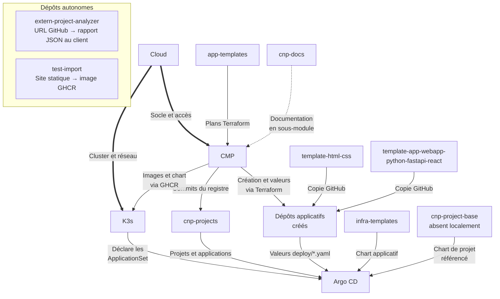

# Cartographie des dépôts et workflows CNP

Cette page centralise l’architecture Git et les échanges entre les **11 dépôts locaux** de la CNP, inspectés le **6 octobre 2026**. Les noms correspondent aux dépôts GitHub `3-Istor` ; `CMP` conserve des noms techniques historiques `arcl-cmp` pour certains charts, ressources et packages.

Les descriptions proviennent du code, des configurations et des pipelines locaux. Elles ne vérifient ni l’état des dépôts distants, ni l’exécution des pipelines, ni l’état en production. Les références à des composants absents et les évolutions prévues sont signalées explicitement.

## Vue d’ensemble

| Dépôt | Rôle | Principaux échanges |
| --- | --- | --- |
| [CMP](#cmp) | Portail et orchestration de la plateforme | Consomme le catalogue Terraform ; écrit le registre et initialise les applications. |
| [Cloud](#cloud) | Socle physique, OpenStack, VPN et cloud | Prépare les ressources cloud, le réseau et les accès utilisés par la plateforme. |
| [K3s](#k3s) | Configuration GitOps et services du cluster | Lit le registre, les charts et les valeurs applicatives via Argo CD. |
| [app-templates](#app-templates) | Catalogue Terraform de provisioning | Fournit les plans Terraform à CMP et initialise les dépôts depuis les templates GitHub. |
| [cnp-docs](#cnp-docs) | Documentation et cartographie centrales | Centralise les contrats et workflows ; sous-module déclaré dans CMP. |
| [cnp-projects](#cnp-projects) | Registre Git des projets et applications | Reçoit les écritures CMP ; fournit les ProjectRecord aux ApplicationSet. |
| [extern-project-analyzer](#extern-project-analyzer) | Analyse statique de dépôts externes | Reçoit une URL GitHub ; retourne un rapport JSON au client appelant. |
| [infra-templates](#infra-templates) | Chart Helm générique des applications | Reçoit les valeurs applicatives au rendu ; fournit les manifests Helm à Argo CD. |
| [template-app-webapp-python-fastapi-react](#template-app-webapp-python-fastapi-react) | Modèle applicatif FastAPI et React | Fournit une base fullstack, deux images et deux fichiers de valeurs. |
| [template-html-css](#template-html-css) | Modèle applicatif HTML/CSS | Fournit une base statique, une image et un fichier de valeurs. |
| [test-import](#test-import) | Application statique de test | Produit une image statique de test ; consommateur GitOps non établi. |

## Schéma des échanges inter-repo

Une flèche va du **fournisseur vers le consommateur** : son libellé indique ce qui est transmis. Une écriture va donc de son auteur vers le dépôt modifié. Les blocs « Argo CD » et « dépôts applicatifs créés » représentent des intermédiaires, pas des dépôts supplémentaires inventoriés. Le groupe autonome indique les deux dépôts dont aucun consommateur CNP n’est établi.

- Flèche pleine : échange technique configuré dans le code ou les manifests.
- Flèche pointillée : relation documentaire, explicitement libellée.
- Flèche épaisse : prérequis d’infrastructure fourni par Cloud, sans automatisation inter-repo établie.
- `cnp-project-base` : dépendance Git référencée mais absente localement ; son contenu n’a pas été audité.

La copie des templates et l’écriture des valeurs sont réalisées par les plans de `app-templates` exécutés dans CMP. Argo CD est un service configuré par `K3s` : les lectures de `cnp-projects`, `infra-templates` et des dépôts applicatifs passent par lui.

`test-import` publie une image par sa CI ; son déploiement CNP n’est pas établi. Aucun appel de CMP à l’analyseur externe n’a été trouvé. Les relations documentaires indiquent le rôle de `cnp-docs`, sans suggérer un échange de données à l’exécution.

## Fiches des dépôts

### CMP

#### Rôle

Portail de gestion de la CNP : catalogue, projets, déploiements et suivi des ressources. Le backend orchestre Terraform et publie les projets et applications dans le registre Git ; le frontend expose ces opérations aux utilisateurs.

#### Technologies

Python 3.12+, FastAPI, SQLAlchemy/Alembic ; TypeScript, Next.js 16, React 19, Tailwind CSS ; Terraform, Docker, Helm et GitHub Actions.

#### Entrées

| Origine / destinataire | Contenu et transmission |
| --- | --- |
| app-templates | Clone Git du catalogue : `templates/*/manifest.json`, modules et configurations Terraform. |
| cnp-projects | Lecture des `registry/projects/*.yaml` via la GitHub App avant mise à jour du registre. |
| Services de plateforme | Identité Keycloak, secrets Vault, API GitHub, Cloudflare et fournisseurs cloud ; paramètres de déploiement saisis par les utilisateurs. |
| cnp-docs | Documentation déclarée comme sous-module dans `.kiro/steering/docs` pour les développeurs et assistants. |

#### Sorties et consommateurs

| Origine / destinataire | Contenu et transmission |
| --- | --- |
| cnp-projects | Création et mise à jour des ProjectRecord et de leur liste d’applications par commits via la GitHub App. |
| Dépôts applicatifs | Création et configuration via les templates Terraform exécutés : sources initiales et valeurs `deploy/*.yaml`. |
| K3s / opérateurs | Images backend/frontend et chart `arcl-cmp` publiés dans GHCR ; consommés par la configuration GitOps de K3s. |
| Utilisateurs / clients API | API HTTP, interface web, état des opérations, URL et outputs Terraform. |

#### Documentation CNP

[README du dépôt](https://github.com/3-Istor/CMP/blob/main/README.md). Cette fiche fait partie de la cartographie centrale.

**Sources vérifiables :** [backend/app/services/template_repository.py](https://github.com/3-Istor/CMP/blob/main/backend/app/services/template_repository.py), [backend/app/services/project_registry.py](https://github.com/3-Istor/CMP/blob/main/backend/app/services/project_registry.py), [backend/app/services/terraform_orchestrator.py](https://github.com/3-Istor/CMP/blob/main/backend/app/services/terraform_orchestrator.py), [.gitmodules](https://github.com/3-Istor/CMP/blob/main/.gitmodules), [.github/workflows/build-and-push.yml](https://github.com/3-Istor/CMP/blob/main/.github/workflows/build-and-push.yml), [.github/workflows/helm-release.yml](https://github.com/3-Istor/CMP/blob/main/.github/workflows/helm-release.yml).

### Cloud

#### Rôle

Configuration du socle physique et cloud : nœuds NUC, OpenStack, réseau VPN et infrastructures Terraform OpenStack/AWS. Ce dépôt prépare les environnements sur lesquels la plateforme et ses applications peuvent fonctionner.

#### Technologies

Terraform/HCL, OpenStack et Kolla-Ansible, WireGuard, Netplan, scripts Shell ; configurations Kubernetes et scripts Python pour le chemin EKS.

#### Entrées

| Origine / destinataire | Contenu et transmission |
| --- | --- |
| Opérateurs / fournisseurs cloud | Inventaire des machines, paramètres réseau, accès OpenStack/AWS et variables Terraform. |
| Autres dépôts CNP | Aucune consommation automatisée de fichiers d’un autre dépôt CNP identifiée dans le périmètre inspecté. |

#### Sorties et consommateurs

| Origine / destinataire | Contenu et transmission |
| --- | --- |
| K3s / opérateurs | Machines, réseau et accès nécessaires au bootstrap du cluster ; relation de prérequis d’infrastructure, sans clone automatique de Cloud par K3s identifié. |
| app-templates / CMP | API et ressources cloud utilisables par les providers Terraform ; environnement OpenStack utilisé pour les déploiements. |
| Opérateurs | Procédures de connexion, configuration du VPN et des nœuds, définitions Terraform et données FinOps. |

#### Documentation CNP

[README du dépôt](https://github.com/3-Istor/Cloud/blob/main/README.md). Cette fiche fait partie de la cartographie centrale.

**Sources vérifiables :** [nuc_config/README.md](https://github.com/3-Istor/Cloud/blob/main/nuc_config/README.md), [vpn_mesh/README.md](https://github.com/3-Istor/Cloud/blob/main/vpn_mesh/README.md), [terraform/openstack/projects/3-istor-cloud/instances.tf](https://github.com/3-Istor/Cloud/blob/main/terraform/openstack/projects/3-istor-cloud/instances.tf), [terraform/public/aws/EKS/README.md](https://github.com/3-Istor/Cloud/blob/main/terraform/public/aws/EKS/README.md).

### K3s

#### Rôle

Dépôt GitOps du cluster et des services de plateforme. Il installe les composants communs et contient les ApplicationSet qui génèrent les projets et applications depuis le registre CNP.

#### Technologies

Kubernetes YAML, Kustomize, Helm, Argo CD/ApplicationSet ; configuration de Keycloak, Vault, opérateur de secrets, Envoy Gateway, stockage et observabilité ; GitHub Actions.

#### Entrées

| Origine / destinataire | Contenu et transmission |
| --- | --- |
| Cloud / opérateurs | Cluster, réseau et accès préalablement préparés ; prérequis d’infrastructure. |
| cnp-projects | `registry/projects/*.yaml` pour les ApplicationSet et `projects/` pour l’Application racine historique. |
| infra-templates / dépôts applicatifs | Chart Helm générique et valeurs `deploy/values.yaml` ou `deploy/values-{frontend,backend}.yaml`, lus par Argo CD. |
| cnp-project-base (absent localement) | Chart référencé pour générer les AppProject et les services par projet. |
| CMP / GHCR et charts externes | Images CMP et chart OCI `arcl-cmp`, plus les charts et manifests des composants de plateforme. |

#### Sorties et consommateurs

| Origine / destinataire | Contenu et transmission |
| --- | --- |
| Argo CD / clusters cibles | Manifests de plateforme, ApplicationSet et Applications déclarant les ressources à réconcilier. |
| CMP / applications | Services d’identité, secrets, réseau, stockage et livraison GitOps. |

#### Documentation CNP

[README du dépôt](https://github.com/3-Istor/K3s/blob/main/README.md). Cette fiche fait partie de la cartographie centrale.

**Sources vérifiables :** [k8s/config/argocd/kustomization.yaml](https://github.com/3-Istor/K3s/blob/main/k8s/config/argocd/kustomization.yaml), [k8s/config/argocd/applicationset-projects.yaml](https://github.com/3-Istor/K3s/blob/main/k8s/config/argocd/applicationset-projects.yaml), [k8s/config/argocd/applicationset-apps.yaml](https://github.com/3-Istor/K3s/blob/main/k8s/config/argocd/applicationset-apps.yaml), [k8s/app/cnp-projects-root.yaml](https://github.com/3-Istor/K3s/blob/main/k8s/app/cnp-projects-root.yaml), [k8s/config/arcl-cmp/kustomization.yaml](https://github.com/3-Istor/K3s/blob/main/k8s/config/arcl-cmp/kustomization.yaml), [k8s/config/arcl-cmp/cmp-values.yaml](https://github.com/3-Istor/K3s/blob/main/k8s/config/arcl-cmp/cmp-values.yaml).

### app-templates

#### Rôle

Catalogue des plans de provisioning exécutés par CMP. Les templates assemblent les modules d’infrastructure et de configuration ; `project-bootstrap` prépare un projet et `k3s-gitops-app` initialise une application GitOps.

#### Technologies

Terraform/HCL, manifests JSON, templates cloud-init et YAML, scripts Shell ; providers OpenStack, AWS, GitHub, Keycloak, Vault et Cloudflare selon le template.

#### Entrées

| Origine / destinataire | Contenu et transmission |
| --- | --- |
| CMP | Variables du projet et de l’application, cloud cible, paramètres et accès nécessaires à l’exécution Terraform. |
| template-html-css / template-app-webapp-python-fastapi-react | Dépôt source choisi via `template_repo_name` ; copie par le mécanisme GitHub repository template. |
| Cloud / services externes | Infrastructure cloud et API accessibles, identité, secrets et DNS nécessaires aux providers. |

#### Sorties et consommateurs

| Origine / destinataire | Contenu et transmission |
| --- | --- |
| CMP | Catalogue `manifest.json` et plans Terraform récupérés par clone Git ; outputs de l’exécution. |
| Dépôts applicatifs | Dépôts privés initialisés à partir du template choisi et fichiers `deploy/*.yaml` configurés. |
| Services cloud / identité / secrets | Ressources provisionnées par le template sélectionné. Sur le chemin `k3s-gitops-app`, GitHub, Keycloak, Vault et DNS sont configurés ; les objets applicatifs Kubernetes sont générés par Argo CD depuis le registre. |

#### Documentation CNP

[README du dépôt](https://github.com/3-Istor/app-templates/blob/main/README.md). Cette fiche fait partie de la cartographie centrale.

**Sources vérifiables :** [templates/k3s-gitops-app/manifest.json](https://github.com/3-Istor/app-templates/blob/main/templates/k3s-gitops-app/manifest.json), [templates/k3s-gitops-app/main.tf](https://github.com/3-Istor/app-templates/blob/main/templates/k3s-gitops-app/main.tf), [templates/k3s-gitops-app/outputs.tf](https://github.com/3-Istor/app-templates/blob/main/templates/k3s-gitops-app/outputs.tf), [templates/project-bootstrap/main.tf](https://github.com/3-Istor/app-templates/blob/main/templates/project-bootstrap/main.tf).

### cnp-docs

#### Rôle

Documentation centrale de la CNP : architecture, contrats, composants, workflows et cartographie des dépôts. Les README locaux décrivent leur dépôt et renvoient ici pour comprendre l’ensemble.

#### Technologies

Markdown, MkDocs Material, Mermaid, YAML et GitHub Actions ; modèles Noodle et exports draw.io/PNG pour les diagrammes d’architecture existants.

#### Entrées

| Origine / destinataire | Contenu et transmission |
| --- | --- |
| Les dix autres dépôts locaux | Code, manifests et workflows consultés par les rédacteurs pour vérifier les descriptions et dépendances ; aucune génération automatique des fiches. |
| Contributeurs | Décisions et procédures techniques documentées, modèles et vues d’architecture. |

#### Sorties et consommateurs

| Origine / destinataire | Contenu et transmission |
| --- | --- |
| Équipe CNP / lecteurs | Site de documentation construit avec MkDocs et publié par le workflow GitHub Pages. |
| CMP / développeurs et assistants | Sources Markdown référencées comme sous-module dans `.kiro/steering/docs`. |
| Tous les dépôts CNP | Cartographie centrale vers laquelle pointent les README locaux. |

#### Documentation CNP

[README du dépôt](https://github.com/3-Istor/cnp-docs/blob/main/README.md). Cette fiche fait partie de la cartographie centrale.

**Sources vérifiables :** [mkdocs.yml](https://github.com/3-Istor/cnp-docs/blob/main/mkdocs.yml), [.github/workflows/deploy-docs.yml](https://github.com/3-Istor/cnp-docs/blob/main/.github/workflows/deploy-docs.yml), [architecture/README.md](https://github.com/3-Istor/cnp-docs/blob/main/architecture/README.md).

### cnp-projects

#### Rôle

Registre Git des projets CNP : chaque ProjectRecord décrit le placement cloud, les environnements, fonctionnalités et applications d’un projet. Le répertoire `projects/` racine est distinct et destiné aux manifests de l’Application Argo CD historique.

#### Technologies

YAML, JSON Schema, validateur Python, Make et GitHub Actions ; données consommées par Argo CD.

#### Entrées

| Origine / destinataire | Contenu et transmission |
| --- | --- |
| CMP | Écritures des projets et des applications via la GitHub App dans `registry/projects/<nom>.yaml`. |
| Opérateurs | Modifications Git du registre, soumises au schéma et aux contraintes de placement. |

#### Sorties et consommateurs

| Origine / destinataire | Contenu et transmission |
| --- | --- |
| K3s / Argo CD | ProjectRecord lus par les ApplicationSet pour générer AppProject, services et applications ; `spec.targetCloud` choisit la destination. |
| cnp-project-base (absent localement) | Valeurs de projet, fonctionnalités et hostnames transmises au chart par les ApplicationSet. |
| CMP / contributeurs | Registre lisible par API GitHub, schéma et validation locale/CI. CMP conserve un miroir du placement en base. |

#### Documentation CNP

[README du dépôt](https://github.com/3-Istor/cnp-projects/blob/main/README.md). Cette fiche fait partie de la cartographie centrale.

**Sources vérifiables :** [registry/README.md](https://github.com/3-Istor/cnp-projects/blob/main/registry/README.md), [registry/schema.json](https://github.com/3-Istor/cnp-projects/blob/main/registry/schema.json), [scripts/validate-registry.py](https://github.com/3-Istor/cnp-projects/blob/main/scripts/validate-registry.py), [.github/workflows/validate-registry.yml](https://github.com/3-Istor/cnp-projects/blob/main/.github/workflows/validate-registry.yml).

### extern-project-analyzer

#### Rôle

Service d’analyse statique de dépôts GitHub externes : clone temporaire, détection des langages et frameworks, recommandation de template et de commandes. Il lit les fichiers sans exécuter le code analysé.

#### Technologies

Python, FastAPI, Pydantic, Git, pytest, Docker/Compose et GitHub Actions.

#### Entrées

| Origine / destinataire | Contenu et transmission |
| --- | --- |
| Client HTTP / dépôt GitHub externe | `POST /analyze` reçoit `github_url`, un `token` facultatif pour un dépôt privé et une `branch` facultative ; les fichiers sont clonés temporairement. |
| CMP | Aucun appel à ce service trouvé dans le backend ou le frontend CMP inspectés. |

#### Sorties et consommateurs

| Origine / destinataire | Contenu et transmission |
| --- | --- |
| Client HTTP appelant | Réponse JSON : dépôt, template principal, langages, frameworks, confiance, indices et commandes recommandées. |
| GHCR / opérateurs | Image Docker construite et publiée par CI ; aucun consommateur CNP automatisé identifié localement. |

#### Documentation CNP

[README du dépôt](https://github.com/3-Istor/extern-project-analyzer/blob/main/README.md). Cette fiche fait partie de la cartographie centrale.

**Sources vérifiables :** [app/main.py](https://github.com/3-Istor/extern-project-analyzer/blob/main/app/main.py), [app/schemas.py](https://github.com/3-Istor/extern-project-analyzer/blob/main/app/schemas.py), [app/analyzer.py](https://github.com/3-Istor/extern-project-analyzer/blob/main/app/analyzer.py), [.github/workflows/docker-image.yml](https://github.com/3-Istor/extern-project-analyzer/blob/main/.github/workflows/docker-image.yml).

### infra-templates

#### Rôle

Chart Helm `cnp-generic-app` commun aux applications CNP. Il transforme les valeurs d’un dépôt applicatif en ressources Kubernetes et peut être rendu par Argo CD ou utilisé manuellement avec Helm.

#### Technologies

Helm 3, templates Go et YAML Kubernetes ; ressource `VaultSecret` de l’opérateur `ricoberger.de` lorsque les secrets sont activés.

#### Entrées

| Origine / destinataire | Contenu et transmission |
| --- | --- |
| Dépôts applicatifs | Valeurs `deploy/*.yaml` : image/tag, ports, ressources, configuration et chemin Vault éventuel. |
| K3s / Argo CD ou opérateurs | Nom de release, namespace et paramètres du rendu Helm ; opérateur de secrets disponible si `secrets.enabled=true`. |

#### Sorties et consommateurs

| Origine / destinataire | Contenu et transmission |
| --- | --- |
| K3s / Argo CD | Chart récupéré depuis Git pour rendre Deployment, Service, ConfigMap et VaultSecret selon les valeurs. |
| Clusters / opérateurs | Manifests appliqués par Argo CD ou Helm ; aucune image applicative construite dans ce dépôt. |

#### Documentation CNP

[README du dépôt](https://github.com/3-Istor/infra-templates/blob/main/README.md). Cette fiche fait partie de la cartographie centrale.

**Sources vérifiables :** [Chart.yaml](https://github.com/3-Istor/infra-templates/blob/main/Chart.yaml), [values.yaml](https://github.com/3-Istor/infra-templates/blob/main/values.yaml), [templates/deployment.yaml](https://github.com/3-Istor/infra-templates/blob/main/templates/deployment.yaml), [templates/vaultsecret.yaml](https://github.com/3-Istor/infra-templates/blob/main/templates/vaultsecret.yaml).

### template-app-webapp-python-fastapi-react

#### Rôle

Modèle de dépôt applicatif fullstack : backend FastAPI et frontend React/Vite, configurations locales, conteneurs et valeurs de déploiement distinctes pour les deux composants.

#### Technologies

Python, FastAPI, Uvicorn, SQLAlchemy et Pydantic Settings ; JavaScript/JSX, React 19, Vite, Docker/Compose, YAML Helm et GitHub Actions. Les Dockerfiles utilisent Python 3.14 et Node.js 26.

#### Entrées

| Origine / destinataire | Contenu et transmission |
| --- | --- |
| CMP / app-templates | Sélection comme template GitHub ; lors du provisioning, `k3s-gitops-app` écrit les valeurs du projet dans la copie créée. |
| Développeurs / environnement applicatif | Code métier, variables d’environnement et base SQLite/PostgreSQL facultative. |

#### Sorties et consommateurs

| Origine / destinataire | Contenu et transmission |
| --- | --- |
| Dépôts applicatifs / développeurs | Sources backend/frontend, Dockerfiles, CI et configurations copiés par GitHub lors de la création du dépôt. |
| GHCR / cluster cible | Deux images, `<owner>/<repo>/frontend` et `<owner>/<repo>/backend`, construites par la CI du dépôt. |
| K3s / Argo CD / infra-templates | `deploy/values-frontend.yaml` et `deploy/values-backend.yaml` de la copie applicative, utilisés pour rendre le chart générique. |

#### Documentation CNP

[README du dépôt](https://github.com/3-Istor/template-app-webapp-python-fastapi-react/blob/main/README.md). Cette fiche fait partie de la cartographie centrale.

**Sources vérifiables :** [backend/requirements.txt](https://github.com/3-Istor/template-app-webapp-python-fastapi-react/blob/main/backend/requirements.txt), [frontend/package.json](https://github.com/3-Istor/template-app-webapp-python-fastapi-react/blob/main/frontend/package.json), [backend/Dockerfile](https://github.com/3-Istor/template-app-webapp-python-fastapi-react/blob/main/backend/Dockerfile), [frontend/Dockerfile](https://github.com/3-Istor/template-app-webapp-python-fastapi-react/blob/main/frontend/Dockerfile), [deploy/values-frontend.yaml](https://github.com/3-Istor/template-app-webapp-python-fastapi-react/blob/main/deploy/values-frontend.yaml), [deploy/values-backend.yaml](https://github.com/3-Istor/template-app-webapp-python-fastapi-react/blob/main/deploy/values-backend.yaml), [.github/workflows/ci.yml](https://github.com/3-Istor/template-app-webapp-python-fastapi-react/blob/main/.github/workflows/ci.yml).

### template-html-css

#### Rôle

Modèle de dépôt applicatif statique : site HTML/CSS servi par Nginx, accompagné d’une CI Docker et de valeurs de déploiement Kubernetes.

#### Technologies

HTML5, CSS, Nginx Alpine, Docker, YAML Helm et GitHub Actions.

#### Entrées

| Origine / destinataire | Contenu et transmission |
| --- | --- |
| CMP / app-templates | Sélection comme template GitHub ; `k3s-gitops-app` configure `deploy/values.yaml` dans la copie applicative. |
| Développeurs | Pages, styles et contenu du site. |

#### Sorties et consommateurs

| Origine / destinataire | Contenu et transmission |
| --- | --- |
| Dépôts applicatifs / développeurs | Site, Dockerfile, CI et valeurs de déploiement copiés lors de la création GitHub. |
| GHCR / cluster cible | Image `<owner>/<repo>` contenant le site servi par Nginx. |
| K3s / Argo CD / infra-templates | `deploy/values.yaml` de la copie applicative, consommé avec le chart générique. |

#### Documentation CNP

[README du dépôt](https://github.com/3-Istor/template-html-css/blob/main/README.md). Cette fiche fait partie de la cartographie centrale.

**Sources vérifiables :** [Dockerfile](https://github.com/3-Istor/template-html-css/blob/main/Dockerfile), [deploy/values.yaml](https://github.com/3-Istor/template-html-css/blob/main/deploy/values.yaml), [.github/workflows/ci.yml](https://github.com/3-Istor/template-html-css/blob/main/.github/workflows/ci.yml).

### test-import

#### Rôle

Dépôt applicatif de test contenant une base HTML/CSS semblable au template statique. Il permet de travailler sur un exemple d’application ; son nom seul ne prouve pas un workflow d’import CMP.

#### Technologies

HTML5, CSS, Nginx Alpine, Docker, YAML Helm et GitHub Actions.

#### Entrées

| Origine / destinataire | Contenu et transmission |
| --- | --- |
| Développeurs | Contenu du site et changements de code. |
| template-html-css | Contenu et configuration similaires présents localement ; la provenance de création n’est pas établie par cette inspection. |

#### Sorties et consommateurs

| Origine / destinataire | Contenu et transmission |
| --- | --- |
| GHCR / utilisateurs | Image `ghcr.io/3-istor/test-import` produite par la CI et site statique. |
| Éventuel déploiement Helm | `deploy/values.yaml` disponible, mais il référence encore `ghcr.io/3-istor/template-html-css`. Aucun enregistrement de `test-import` trouvé dans le registre local ; aucun déploiement CNP de ce dépôt n’est établi. |

#### Documentation CNP

[README du dépôt](https://github.com/3-Istor/test-import/blob/main/README.md). Cette fiche fait partie de la cartographie centrale.

**Sources vérifiables :** [Dockerfile](https://github.com/3-Istor/test-import/blob/main/Dockerfile), [deploy/values.yaml](https://github.com/3-Istor/test-import/blob/main/deploy/values.yaml), [.github/workflows/ci.yml](https://github.com/3-Istor/test-import/blob/main/.github/workflows/ci.yml).

## Workflows entre dépôts

### 1. Préparer le socle

Les opérateurs utilisent `Cloud` pour configurer les nœuds, le VPN, OpenStack et les ressources cloud. Ils préparent un cluster et ses accès avant de lancer le bootstrap décrit dans le README de `K3s`. Les manifests Kustomize/Helm de `K3s` déclarent Argo CD et les autres composants communs.

Cette relation est un prérequis d’exploitation : aucun pipeline local n’établit une chaîne automatique `Cloud → K3s`. Les chemins AWS/EKS présents dans Cloud ne prouvent pas qu’un cluster distant est en service. La configuration Argo CD inclut le cluster `onprem` ; l’ajout des clusters AWS/GCP reste conditionné à leur préparation et à leurs secrets.

### 2. Provisionner un projet puis une application

1. CMP récupère `app-templates` via son service de catalogue et lit les manifests activés.
2. CMP publie le ProjectRecord dans `cnp-projects/registry/projects/` via la GitHub App, puis lance en tâche de fond le bootstrap Terraform `project-bootstrap` avec les paramètres et accès requis. La publication du registre précède donc la fin du provisioning.
3. Pour une application GitOps, CMP exécute `k3s-gitops-app`. Terraform utilise le template GitHub statique ou fullstack choisi, crée le dépôt privé, puis renseigne ses valeurs `deploy/*.yaml`. Il configure aussi les éléments d’identité, secrets et DNS prévus dans ce module.
4. CMP ajoute l’application au ProjectRecord : type, URL du dépôt et hostname. Cette écriture permet sa découverte par Argo CD et l’alimentation de la configuration de routage du projet.

Le module applicatif actuel de `app-templates` n’enregistre pas directement une Application dans l’API Kubernetes. Les objets GitOps sont générés à partir du registre. Un module interne historique `CMP/backend/app/terraform/github_bootstrap` et son orchestrateur SAGA existent aussi ; ils ne doivent pas être confondus avec le chemin catalogue `k3s-gitops-app` décrit ici.

L’écriture du registre applicatif est traitée en « best effort » dans `terraform_orchestrator.py` : un apply réussi peut être suivi d’une erreur de registre journalisée. Dans ce cas, le succès Terraform seul ne garantit ni la découverte de l’application ni son routage.

**Sources :** [catalogue CMP](https://github.com/3-Istor/CMP/blob/main/backend/app/services/template_repository.py), [bootstrap projet CMP](https://github.com/3-Istor/CMP/blob/main/backend/app/services/project_bootstrap.py), [route projets](https://github.com/3-Istor/CMP/blob/main/backend/app/routers/projects.py), [orchestrateur Terraform](https://github.com/3-Istor/CMP/blob/main/backend/app/services/terraform_orchestrator.py), [module historique](https://github.com/3-Istor/CMP/blob/main/backend/app/terraform/github_bootstrap/main.tf).

### 3. Générer et synchroniser les ressources GitOps

Les ApplicationSet présents dans `K3s` lisent les ProjectRecord de `cnp-projects` :

- `applicationset-projects.yaml` référence `cnp-project-base` pour les AppProject sur le plan de contrôle et les services par projet sur le cluster cible. Les valeurs sont construites à partir du placement, des fonctionnalités et des hostnames du registre. Le contenu du chart absent n’a pas été vérifié.
- `applicationset-apps.yaml` crée une Application par composant applicatif. Une application statique utilise `deploy/values.yaml` ; une application fullstack utilise une Application frontend et une backend avec leurs fichiers de valeurs respectifs.
- Chaque Application associe deux sources Git : `infra-templates` fournit le chart et le dépôt applicatif fournit les valeurs via la référence `$values`. `spec.targetCloud` sélectionne la destination Argo CD.

Argo CD rend les charts et synchronise les ressources Kubernetes. Il consomme des déclarations Git ; les pods téléchargent les images depuis le registre de conteneurs. Le répertoire `cnp-projects/projects/`, lu par l’Application racine historique, reste distinct des ProjectRecord.

**Sources :** [ApplicationSet projets](https://github.com/3-Istor/K3s/blob/main/k8s/config/argocd/applicationset-projects.yaml), [ApplicationSet applications](https://github.com/3-Istor/K3s/blob/main/k8s/config/argocd/applicationset-apps.yaml), [contrat du registre](https://github.com/3-Istor/cnp-projects/blob/main/registry/README.md).

### 4. Construire et livrer les images

Les workflows des templates sont copiés avec les sources applicatives :

- Le template statique construit une image Nginx `ghcr.io/<owner>/<repo>` ; les pushes publient l’image, les pull requests effectuent la construction sans publication.
- Le template fullstack teste le backend et construit le frontend, puis publie deux images sur un push vers `main` : `ghcr.io/<owner>/<repo>/frontend` et `/backend`.
- `test-import` possède sa propre CI statique. Son fichier de valeurs référence encore l’image du template d’origine ; la présence de ce fichier n’établit pas une livraison de sa propre image par la CNP.
- CMP publie ses images sur tags `v*.*.*` et son chart OCI sur tags `helm-v*.*.*`. `K3s` déclare le chart et les images CMP, ainsi qu’un ImageUpdater CMP dont la méthode de mise à jour actuelle est `argocd` : elle modifie l’Application Argo CD plutôt que de créer un commit Git. Le fichier indique que le retour à l’écriture Git dépend du rétablissement des permissions du bot.

Une publication d’image ne garantit pas à elle seule le déploiement d’une nouvelle version : les valeurs Git, la stratégie de mise à jour et la synchronisation Argo CD déterminent la version exécutée. L’exécution effective des workflows et de l’ImageUpdater n’a pas été testée ici.

**Sources :** [CI statique](https://github.com/3-Istor/template-html-css/blob/main/.github/workflows/ci.yml), [CI fullstack](https://github.com/3-Istor/template-app-webapp-python-fastapi-react/blob/main/.github/workflows/ci.yml), [CI test-import](https://github.com/3-Istor/test-import/blob/main/.github/workflows/ci.yml), [ImageUpdater CMP](https://github.com/3-Istor/K3s/blob/main/k8s/app/arcl-cmp/arcl-cmp-updater.yaml).

### 5. Analyser un dépôt externe

Un client appelle `POST /analyze` avec une URL GitHub et, si nécessaire, une branche et un token. `extern-project-analyzer` clone le dépôt dans un répertoire temporaire, lit les fichiers, retourne un rapport JSON puis supprime le clone. Les commandes proposées dans le rapport ne sont pas exécutées.

L’intégration à un parcours CMP reste non établie : aucun appel au service trouvé dans le backend ou le frontend locaux. Le service est donc documenté comme autonome.

### 6. Maintenir et publier la documentation

Les contributeurs actualisent les README et cette page lorsque les contrats changent. `cnp-docs` construit le site MkDocs ; son workflow publie vers GitHub Pages lors des pushes sur les branches configurées. CMP déclare les sources de documentation comme sous-module pour les outils de développement ; cette déclaration ne prouve pas que le checkout local du sous-module est initialisé ou à jour.

## Liens vers les documents détaillés

- [Vue d’ensemble du système](../01-architecture/01-system-overview.md).
- [Provisioning des applications](../03-pipelines-and-workflows/01-app-provisioning-flow.md).
- [Pipelines CI/CD](../03-pipelines-and-workflows/02-ci-cd-pipelines.md).
- [Diagrammes de flux système](../03-pipelines-and-workflows/04-system-flows.md).
- [Templates applicatifs et bootstrap](01-git-app-templates.md).
- [Chart Helm générique](02-helm-generic-chart.md).
- [Provisionneur Terraform](03-terraform-provisioner.md).
- [Chantier multicloud](../06-multicloud/00-index.md).

Ces pages donnent le détail de leur sujet et peuvent contenir des objectifs d’architecture ou des étapes de transition. Pour les échanges inter-repo, les sources citées ci-dessus établissent le comportement local inspecté.
